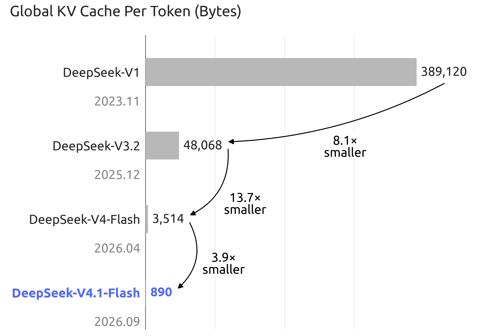
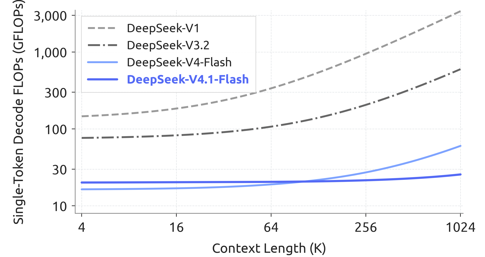
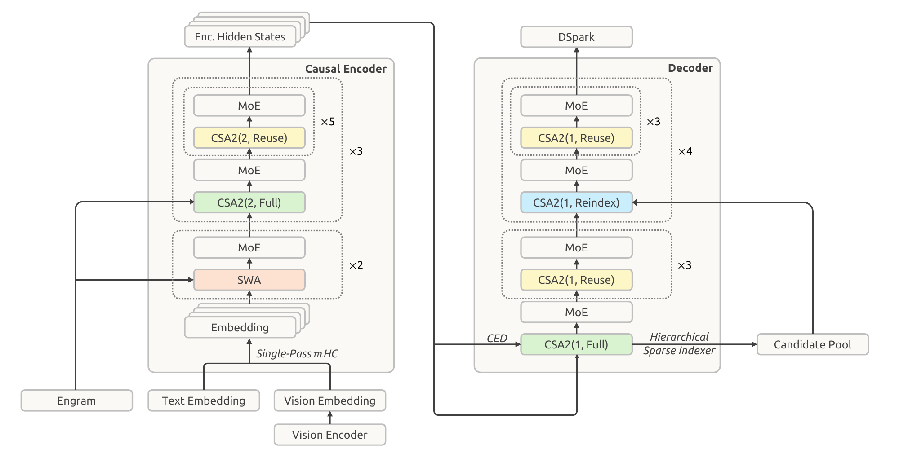
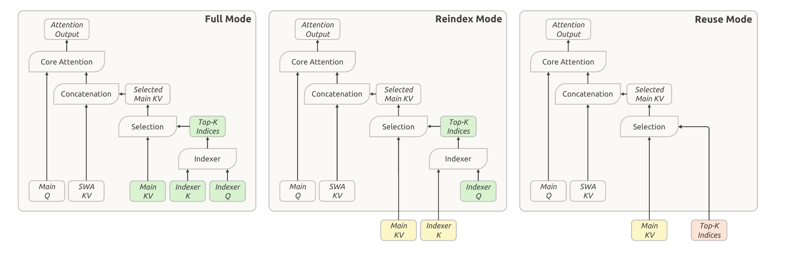
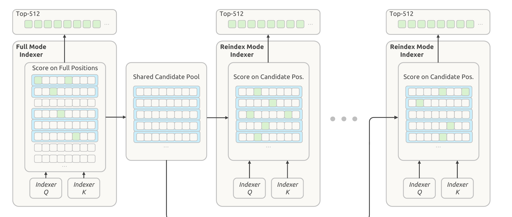

# 把 KV Cache 压缩推到极限：DeepSeek-V4.1-Flash 技术报告精读

> 2026 年 8 月，[当百万 Token KV Cache 从 250GB 降到 5GB](post-kv-cache-era-challenges.md) 写下过一句判断：KV Cache 不再是首要矛盾了。一个月后，DeepSeek 用一篇 51 页的技术报告回应——还能再压：global KV 压到 V4-Flash 的 1/4，持久化 KV 压到 1/8。
>
> 它还推翻了那篇文章里的一个判断。当时我们在复用价值表里写过：**Cross-Layer 共享，基本无意义**，理由是压缩后的单层 KV 已经极小。V4.1 的核心创新恰恰是跨层共享。
>
> 2026-09 | 基于 DeepSeek-V4.1-Flash 技术报告（[`deepseek-ai/DeepSeek-V4.1-Flash`](https://huggingface.co/deepseek-ai/DeepSeek-V4.1-Flash)，51 页）与官方 `config.json` 逐条核对；benchmark 数字均为**厂商口径**。report 章节以 § 标注，config 字段以 `等宽` 标注。
>
> **2026-09-12 补**：§十一 补入两个引擎的落地形态（vLLM recipe 2026-09-11 版、SGLang cookbook `6657f7d8`），并据此订正该节原先「引擎侧没有公开信息」的说法。那句是初稿只依据技术报告下的结论，而 vLLM 的 recipe 早在 2026-09-09 就已存在——是没查证，不是当时没有。

---

## 一、先把账算清楚：890 B/token 是什么口径

整篇报告在回答一个问题：**Agent 的上下文越拉越长，KV Cache 的成本怎么压下来？** 长程 Agent 让负载越来越 input-heavy，prefill 的计算、KV 的存储、把 KV 搬来搬去的带宽，三样一起构成部署成本的主要瓶颈。报告的解法全在这三条线上。

### 1.1 一个 token 在每层产生哪些 KV

V4/V4.1 除最前两层只有 SWA 之外，每一层都有两条注意力分支，各自产生自己的 KV：

| 分支                  | 覆盖范围          | 产生的 KV                                                        |
| --------------------- | ----------------- | ---------------------------------------------------------------- |
| global（全局注意力）  | 整个上下文        | **main KV**（压缩后的 KV 条目）+ **indexer K**（供稀疏选择打分） |
| SWA（滑动窗口注意力） | 最近 128 个 token | **SWA KV**（窗口内的未压缩 KV）                                  |

差异在于**随序列长度怎么变**：global 分支的 KV 线性增长，SWA 分支的 KV 量只取决于窗口大小。所以上下文一长，占用的大头就是 global 分支那两类。下文沿用报告的叫法：global 分支这两类合称 **global KV**，SWA 分支那类叫 **SWA KV**。

再交代三个后面反复出现的词：每个 query 有自己的 **main Q**；稀疏选择由一条轻量 **indexer** 完成，它用 **indexer Q** 给 indexer K 打分，选出这个 query 要读的 **Top-K** 个 main KV 条目。这四个词（main KV、indexer K、indexer Q、Top-K）在 §四 会密集出现。

### 1.2 这些 KV 存在哪

同一个 token 的 KV 在生命周期里会依次落在三级存储上，各级的保留策略完全不同：

| 层级                  | 放什么                        | 介质                    | 保留多久     | 受什么约束     |
| --------------------- | ----------------------------- | ----------------------- | ------------ | -------------- |
| 运行时常驻            | 活跃请求的 KV（global + SWA） | HBM                     | 请求生命周期 | 显存容量       |
| SWA 复用池（V4.1 起） | SWA KV，供活跃会话跨轮复用    | 每机划出的 10% 主机内存 | 分钟级 TTL   | 池子定容       |
| 持久化层              | 供跨请求复用的 KV             | SSD + 主机内存          | 至少 72 小时 | 磁盘与内存容量 |

第二、三行是**同一级介质**（主机内存就是 host DRAM，两者是一回事），区别在保留策略：一个是分钟级高周转的专用池，一个是 72 小时起、LRU 管理的前缀缓存。这样分层是有道理的：SWA KV 只在活跃会话的分钟级窗口里被复用，把它混进 72 小时的前缀缓存纯属浪费。

最后一层就是报告说的 **persistent KV cache（持久化 KV）**。V4 的持久层装了两样：全部 global KV，加上 prompt 末尾与输出末尾两个位置的 SWA KV，后者占了近一半容量。V4.1 把 SWA KV 从这一层移走（改放第二行的专用池），持久层就只剩 global KV。

### 1.3 于是数字的口径清楚了

| 指标                              | 数值                                     |
| --------------------------------- | ---------------------------------------- |
| 骨干参数 / Engram 参数            | 552B / 196B                              |
| 每 token 激活（prefill / decode） | **8B / 16B**                             |
| global 分支的 KV，常驻 HBM        | **890 字节/token**，约为 V4-Flash 的 1/4 |
| 持久化 KV（SSD + 主机内存）       | 约为 V4-Flash 的 1/8                     |

1/4 与 1/8 是两个**相乘**的因子：

```text
V4 的持久化 KV
├── SWA KV   ≈ 一半容量  →  V4.1 不再持久化（改主机内存专用池 + 有界重放）
└── global KV ≈ 另一半    →  V4.1 用 CSA2 + FP4 压到 1/4

1/2 × 1/4 = 1/8
```

1/4 是 global 分支的 KV 本身压到 V4-Flash 四分之一的比例（架构 + 精度），1/8 是再叠加「SWA KV 退出持久层」之后的部署结果。

报告 Figure 1(b) 把这条曲线拉长到了整个世代，逐代绝对值是：V1 的 **389,120** 字节/token、V3.2 的 48,068、V4-Flash 的 3,514，到 V4.1-Flash 只剩 **890**。据此报告给出两个倍数：相对 V4-Flash 约 1/4，相对 V1 约 **1/437**。



_图源：DeepSeek-V4.1-Flash 技术报告 Figure 1(b)。_

不对称激活（prefill 8B、decode 16B）则对着 Agent 负载的形态设计：输入重、输出轻。报告反复强调这一点：长程 Agent 让工作负载越来越 **input-heavy**，prefill 侧的参数激活量因此被单独拿出来优化。

仓库里记录过 vLLM 官方博客的一组数据：V4 在 1M 上下文、bf16 下约 9.62 GiB 每序列（[vLLM 中的 DeepSeek V4](vllm/module_analysis/deepseek_v4_attention_support.md) §8.7 倍节省估算背后的算术）。它和 890 B/token 不能相除，两者不是同一件事：

|          | 9.62 GiB（vLLM 博客）           | 890 B/token（报告）       |
| -------- | ------------------------------- | ------------------------- |
| 模型     | V4-Pro，61 层                   | V4.1-Flash，40 层         |
| 精度     | bf16（博客的估算前提）          | main KV FP4               |
| 统计范围 | main KV + c4a 索引器 + SWA 窗口 | 只算常驻 HBM 的 global KV |

9.62 GiB 的用处是提供量级感：890 B/token 在 1M 上下文下不到 1 GB。要做跨代比较，得用报告自己给的 1/4 和 1/8：那是同模型、同条件下的对比，比拿两个异源数字相除可靠。

报告还给了另一个量级感更强的数字：上下文从 4K 扩到 1M，涨了 256 倍，单 token 的 Decode FLOPs 只增加约 1/4。注意这里的 FLOPs 是**按精度加权**计算的（BF16、FP8、FP4 分别记 1、0.5、0.25），所以 FP4 的引入本身就在往下压这条曲线。



_图源：DeepSeek-V4.1-Flash 技术报告 Figure 2。_

### 1.4 用 config.json 对一遍账

报告是自述，`config.json` 是机器的语言。两者对一遍，比读十遍正文更能确认理解无误：

| 报告表述（§2.4、§4.2.1）                                     | `config.json` 实际值                                                                         |
| ------------------------------------------------------------ | -------------------------------------------------------------------------------------------- |
| encoder 分 3 组 × 6 层，每组首层 Full；decoder 首组首层 Full | `kv_source_layer_ids = [2, 8, 14, 20]`，正是这 4 个 Full 层                                  |
| decoder 其余四组首层 Reindex                                 | `index_source_layer_ids` 比上一行多出 `[24, 28, 32, 36]`                                     |
| 候选池 2048 块 × 8 位置                                      | `candidate_topk_blocks = 2048`、`candidate_block_size = 8`、`candidate_source_layer_id = 20` |
| indexer 32 头、head dim 128、top-k 512                       | `index_n_heads = 32`、`index_head_dim = 128`、`index_topk = 512`                             |
| Engram 置于第 1、14 层，2/3/4-gram，8 头                     | `engram_layer_ids = [1, 14]`、`engram_max_ngram_size = 4`、`engram_n_heads = 8`              |
| 196B Engram 参数                                             | `(384006168 + 384016682) × 256 = 196.6B`                                                     |
| mHC 扩展因子 4、Sinkhorn 迭代 20 次                          | `hc_mult = 4`、`hc_sinkhorn_iters = 20`                                                      |
| SwiGLU clamp 阈值 10                                         | `swiglu_limit = 10.0`                                                                        |
| DSpark 一次产出 5 个 draft                                   | `dspark_block_size = 5`、`dspark_target_layer_ids = [37, 38, 39]`                            |
| 滑动窗口 128、上下文 1M                                      | `sliding_window = 128`、`max_position_embeddings = 1048576`                                  |

核对下来，报告的架构描述在 config 里几乎逐条落地。下面几节凡涉及结构的地方，都同时给出 config 佐证。

---

## 二、三个乘性维度：报告给的 KV 成本坐标系

这是整篇报告理论价值最高的一段（§2.3）。它把 KV 存储拆成三个**相乘**的维度：

| 维度                        | 怎么压                          | 代表工作                   |
| --------------------------- | ------------------------------- | -------------------------- |
| entry size（每条目多大）    | GQA 减 KV 头数，MLA 用小 latent | GQA、MLA                   |
| sequence（几 token 压一条） | 每 m 个 token 压成一个条目      | CSA、HCA（V4）             |
| layer（几层共享一份）       | 跨层复用 KV 或索引              | IndexCache、YOIO、HySparse |

报告随即点名了现有跨层工作的三个缺口：

- **IndexCache** 复用 Top-K 索引省下的是索引计算，**不省 main KV 存储**；
- **YOIO** 把稀疏路由算一次全层共享，但全网络共享限制了性能；
- **HySparse** 让稀疏层复用稠密层的 KV，仍是 hybrid 设计，**保留了全量注意力层**。

结论是：没有一个是三个维度同时覆盖的。CSA2 的主张就是三个一起上，并且**把「缓存共享」与「索引复用」解耦**：这两件事可以独立决定。

### 2.1 与仓库里既有判断的冲突

[post-KV-cache 篇](post-kv-cache-era-challenges.md) 的「旧优化技术的位置」表里，Cross-Layer 共享一栏写的是：

> V4 架构下「基本无意义（压缩后的单层 KV 已经极小）」，K3 架构下「同样无意义」

这个判断在当时是合理的：V4 压缩后每层每 token 只剩约 18 字节（c4a 层，见 [KV Cache 存储形态](kv_cache/01_concepts/basic/attention_kv_cache_formats.md)），看起来确实没有可压缩的余地。

V4.1 给出了相反的答案。当单层的绝对量已经很小，压缩的杠杆就从「每层压多少」转向了「几层共用一份」。38 个 CSA2 层里，**只有 4 层产出 main KV**（`kv_source_layer_ids` 的 2/8/14/20，即全部 Full Mode 层），另有 4 层复用 main KV 但自己重算索引（`index_source_layer_ids` 里多出的 24/28/32/36），剩下 30 层连索引都直接复用。

---

## 三、CED：先把 prefill 砍一半

CED（Causal Encoder-Decoder，§2.2）的灵感来自 YoCo：让 Transformer 的上半层直接共享下半层产生的 KV。V4.1 在此基础上改了两件事：KV 的容量，以及 KV 生成的计算深度。

机制不算复杂。40 层切成两半，前 20 层是 causal encoder（头两层是纯 SWA，其余 18 层用 CSA2），后 20 层是 decoder。decoder 的 global KV 不从自己的 hidden state 来，而是从 encoder 的输出投影出来（报告式 1）：



_图源：DeepSeek-V4.1-Flash 技术报告 Figure 3。图中 CSA2(ratio, mode) 标出每层的压缩率与模式，与本文 §四的配置表一致；底部的 Engram、单一入口的 Single-Pass mHC、顶部的 DSpark 也标了出来。_

```text
C_l = H_{L/2} · W_l^KV ,   Z_l = H_{L/2} · W_l^Z ,   l > L/2
```

于是 prefill 只需要算前一半层：

```text
O(N·L)  →  O(N·L/2 + n_win·L/2)  ≈  O(N·L/2)
```

式 1 里的 `l > L/2` 是 CED 的一般形式。接上 CSA2 之后，**只有 decoder 里那个 Full Mode 层真正执行这个投影**。`config.json` 的 `kv_source_layer_ids = [2, 8, 14, 20]` 就是这四个 Full Mode 层（encoder 三个 CSA2 组的首层 2/8/14，加上 decoder 首层的 20），它们是各组 main KV 的生产者，字段名里的「KV 源」指的就是这个。Reindex 与 Reuse 层不投影，直接复用上游结果。

代价在 SWA 上。CED 刻意**保留**了 SWA 的逐层计算（SWA KV 仍从每层自己的 hidden state 生成），理由是这能增加 SWA KV 生成的计算深度。但这意味着 decoder 侧要额外处理 `n_win × L/2` 个 token（`n_win` 是滑动窗口 128，`L` 是总层数）。短 prompt 的多轮对话里，这笔开销并不小。这一处正是第七节要讲的 SWA Bounded Replay 的由来。

---

## 四、CSA2：三档模式，38 层里只有 8 层真干活

CSA2 把每个层的角色**静态**分成三种（§2.3.1）：

| 模式    | main KV    | indexer K | Top-K 索引                                    |
| ------- | ---------- | --------- | --------------------------------------------- |
| Full    | 自己算     | 自己投    | 自己跑 indexer 产生                           |
| Reindex | 复用前面层 | 复用      | **用自己的 indexer Q 重打分**，选择可逐层变化 |
| Reuse   | 复用       | 复用      | 复用，不跑 indexer                            |

三种模式都自己算 main Q 和 SWA KV。Reindex 是这套设计里最实用的一档：它保住了缓存共享，同时允许各层选择不同的条目，避免「一层选错、全组跟着错」。



_图源：DeepSeek-V4.1-Flash 技术报告 Figure 4。看颜色即可分清「哪些是本层算的」：绿 = 本层计算，黄 = 复用最近一个 Full Mode 层的 main KV 与 indexer K，红 = 复用最近一个产索引层（Full 或 Reindex）的 Top-K 索引。Reindex 模式的 indexer Q 是绿的（自己重打分），所以它没有红块。_

这套分工可以一句话概括：**4 层产 KV，4 层重选，剩下 30 层搭便车。**

实际分配（§4.2.1，与 config 一致）：

```text
encoder（18 层 CSA2，压缩率 m=2）→ 3 组 × 6 层
  每组：第 1 层 Full，其余 5 层 Reuse

decoder（20 层 CSA2，压缩率 m=1）→ 5 组 × 4 层
  第 1 组：第 1 层 Full，其余 3 层 Reuse
  其余 4 组：第 1 层 Reindex，其余 3 层 Reuse
```

`index_source_layer_ids = [2, 8, 14, 20, 24, 28, 32, 36]` 正好是 8 个层，两段各四个：前四个是 Full（自己产 main KV 与 indexer K，并从零建候选池），后四个是 Reindex（复用上游 main KV，只用自己的 indexer Q 重打分）。其余 30 个 Reuse 层连 indexer 都不跑。

顺带一个容易忽略的简化：CSA2 去掉了 CSA 的两个设计，相邻压缩条目之间的**重叠**，以及压缩时使用的**绝对位置编码**。同时 indexer K 改为**从 main KV 投影**得到，取代了 CSA 里从 hidden state 单独走一条压缩路径的做法（§2.3）。

---

## 五、层级稀疏索引器：把深层索引从线性变常数

跨层复用减少了 indexer 的**次数**，但剩下的 indexer 仍要扫描整个因果可见上下文。长上下文下这仍是瓶颈。

报告的做法（§2.3.2）分两步：

1. decoder 第一个 Full Mode 层（`candidate_source_layer_id = 20`）扫全量，选出自己的 Top-512；
2. 同时做**块级候选选择**：每块取块内最大分数，选 `candidate_topk_blocks = 2048` 块，每块 `candidate_block_size = 8` 个位置，共 **16,384 个候选位置**，构成候选池。

后续 Reindex 层只在这个池子里打分：

```text
对固定候选池大小，深层 indexer 的每 query 成本
  从「随上下文长度线性」变成「常数」
```



_图源：DeepSeek-V4.1-Flash 技术报告 Figure 5。绿块 = 被选中的索引位置，蓝框 = 按块内最大分数选中的块。最左是 Full Mode 层扫全量并建池，中间与右侧是 Reindex 层只在候选池内打分。_

首层仍要扫全量这一点报告没有回避，它明确写了「Hierarchical indexing therefore reduces the cost of later indexer evaluations while retaining the initial full-range pass」。

另一个细节：这是**训练感知**的设计。候选限制在 post-training 阶段就同样施加，让深层 indexer 在推理时的搜索域下被优化，而不是训练时见过全量、推理时突然被裁剪。

---

## 六、FP4 main KV：为什么敢省掉 global scale

V4 已经对 indexer 的 Q/K 做了 QAT（量化感知训练），V4.1 把 QAT 扩展到 **main KV cache**（§2.4.4）。注意这里 FP4 的作用是**省存储**，不是加速矩阵乘：反量化后才进 attention，所以不必依赖硬件的原生 FP4 矩阵乘支持，跨平台兼容性更好。

格式选了 OCP 标准的 **MXFP4**（E2M1 + 每 16 通道一个 E4M3 scale），跟随 NVFP4 但**省掉二级 global scale**。报告专门推导了为什么能省：

```text
RMSNorm 权重幅值           ≈ 1
512 通道 KV latent 的 L2 范数  ≤ √512
RoPE 保范数 → 旋转后最大绝对值 ≤ √512 ≈ 22.6
训练中观测到的最大幅值      ≈ 10
────────────────────────────────────────
格式可表示上限  448 × 6 = 2688
```

上限比实际需要高出两个量级，所以省掉 global scale 不带来可测的精度下降，还简化了 cache 布局。

两个实现细节：

- 量化位置在 **RoPE 之后**。报告试过在 RoPE 前量化，只带来边际提升，却要在 decode 时付出额外开销。
- **SWA KV 保持 FP8**，不跟着降到 FP4，因为它对量化敏感。

相比 V4 的 FP8 main KV，这一步把存储又压掉近一半，HBM 和 SSD 两侧都受益。

---

## 七、SWA Bounded Replay：把「未命中」变便宜

§3.2 是整篇报告里最值得看的一节。原因倒不在机制本身，而在它换个问法问问题：别的章节都在优化存储，这一节先问「这项缓存该不该存」。

### 7.1 V4 的困境

V4 部署中，**SWA KV 占了持久层近一半的容量**（§3.2.1）。但它的访问模式和「长期保留」策略根本不匹配：

- global KV 有长尾复用特征，值得留 72 小时以上；
- SWA KV 只在活跃会话的**分钟级窗口**内被复用，会话一结束或下一轮开始就作废。

报告的原话是「Persistently storing SWA KV is both costly and ineffective」。至于不存的方案，V4 报告提过 Zero SWA Caching，但精确恢复需要重放 `L × n_win` 个 token，生产环境中代价不可接受。

### 7.2 V4.1 的解法

分两步，缺一不可：

**第一步，把 SWA KV 移出持久层。** 改放每台机器划出 **10% 主机内存（host DRAM）**组成的分布式专用池。池子总量小得多，但 TTL 只有分钟级，过期条目立刻回收给新会话；高周转足以覆盖绝大多数并发活跃会话。global KV 仍在持久层里，保证至少 72 小时。

**第二步，给未命中兜底。** Encoder SWA Bounded Replay：只重放最近 `n_win` 个 token（窗口 128），并把 SWA 截断到重放段：从位置 s 开始重放时，位置 i 的 query 只能看到 `[max(s, i−W+1), i]` 范围内的 SWA key。replay 的 token 只重新生成 SWA KV，global KV 直接复用缓存，不重算也不覆盖。

CED 的 decoder 侧同理：从 encoder 出来之后，decoder 各层的 SWA KV 也只重放 `n_win` 个 token，而且**只用于解码、不进前缀缓存**。

报告用一句话概括这手棋的分量：

> This bounded replay is the cornerstone of the design: it turns a catastrophic miss into a graceful, inexpensive degradation.

换成中文就是这手棋的全部价值：**把一次灾难性的缓存未命中，换成一次廉价的、有界的重算。**

### 7.3 与仓库里既有判断的冲突

[post-KV-cache 篇](post-kv-cache-era-challenges.md) 把「跨类型前缀缓存」列为**需要解决的硬缺口**，依据是 vLLM 代码里的限制：

> `find_longest_cache_hit` "only supports one attention type or two types of full-attention plus exactly one another type"
>
> （转引自 [post-KV-cache 篇](post-kv-cache-era-challenges.md) 对 vLLM 源码的引用，本文未独立核对源码。）

V4.1 没有去实现通用的多类型前缀缓存，而是**让前缀缓存只依赖一种类型**：SWA KV 退出持久层之后，前缀命中只需要匹配 global KV。缺口还在 vLLM 那边，只是不再挡在 V4.1 前面了。

### 7.4 代价：数学上不等价

报告在这里没有含糊（§3.2.2）：

> By design, the reconstructed decoder SWA KV is **not mathematically equivalent** to that from a full decoder forward pass. Also, we find that this strategy has only a negligible impact on response quality.

重放的 prefix state 是近似的，因此未缓存后缀计算出的 global KV 与 SWA KV 依赖于命中位置，**在不同命中点之间并非逐位相同**。为了补偿，post-training 阶段会**模拟同样的 replay**，让模型在这个近似下被训练，报告称之为 train-aware adaptation。

---

## 八、三处配套改动：mHC、Engram、DSpark

**Single-Pass mHC（§2.4.1）**。V4 的 mHC 在相邻 block 之间维护 n 条残差流，更新公式分三步，实现上是三个 kernel 串行（数据依赖决定）：

```text
X_l = B_{l-1} X_{l-1} + C_{l-1} Y_{l-1}    残差更新
(A_l, B_l, C_l) = H(X_l)                    系数预测
X̂_l = A_l X_l                              输入混合
```

三段合起来激活内存流量是 `(4n+4)d`，是理想下界 `(2n+2)d` 的两倍。V4.1 的办法很巧：把 input-mixing 系数**位移一个 block**，每块用前一块产出的系数：

```text
X_{l+1} = B_l X_l + C_l F_l(A_{l-1} X_l)
```

**相当于把依赖关系整体挪开一格**，残差流的每一块 tile 于是可以立即同时用于输入混合和系数预测。部署侧再用 **Mega-mHC** 把三个 kernel 融成一个，拿到理想的 `(n+1)d` 读 + `(n+1)d` 写，流量减半。config 里的 `hc_mult = 4`、`hc_sinkhorn_iters = 20` 与前文一致。

> [post-KV-cache 篇](post-kv-cache-era-challenges.md) 对 mHC 的判断有点摇摆：§6.4 说 fused kernel 已经覆盖，§6.2 末尾又留了一句「可能无法被现有推理引擎的 kernel fusion 覆盖」。V4.1 回答的是后一个问题——不是覆盖不了，而是要先改掉依赖关系。

**Engram（§2.4.2）**是条件记忆模块，196B 参数，放在第 1 和第 14 层。每个模块用 2/3/4-gram、8 个 hash head，每个 order 的总嵌入维度 2048，每张表约 16M 条目、表大小取不同质数。嵌入表与 KV 投影都用 FP8。相比原设计省掉了短因果卷积（收益不足以抵消推理栈的复杂度）。推理时地址是确定的，所以嵌入可以从主机内存用 **RDMA 后台预取**，第一个模块的预取与第一个 Transformer block 的计算重叠。

**DSpark（§2.4.3）**是投机解码模块。drafter 是 3 个 Transformer block（SWA 窗口 128），一次前向并行算出 5 个 draft 位置的 base logits，另有一个轻量 Markov head 建模 draft token 间的依赖，一个 confidence head 预测每个位置的接受概率。调度器结合这些估计与**实测的引擎吞吐曲线**，为每个请求动态选择验证长度。与 V3 的 MTP 不同，DSpark 在预训练之后单独训练，backbone 冻结；post-training 阶段继续训练但梯度不回传 backbone，让它跟上策略演进。

**内核数**。Reuse Mode 层在 prefill 只需 **15 个 kernel**、decode **11 个**（§3.2）。报告的原话是「架构概念上复杂，但由此产生的推理内核流出乎意料地简洁」。

**EPD 分离**把 Encoder / Prefill / Decode 三段解耦，独立伸缩、执行重叠（§3.2）。

---

## 九、训练侧：45T token 与「无算法创新的后训练」

预训练的关键配置（§4.2.2）：

| 项              | 值                                                              |
| --------------- | --------------------------------------------------------------- |
| 训练 token 总量 | **45T**（多模态）                                               |
| batch size      | 100.6M tokens（全程固定）                                       |
| 学习率          | 2000 步 warmup → 2.6e-4，28T 起 cosine 衰减至 2.6e-5            |
| 序列长度        | **从零开始就用稀疏注意力，64K 起步；34T token 处扩展到 1M**     |
| 数据配比        | 文本 : 多模态 = 7 : 1                                           |
| 优化器          | 线性层 Muon，RMSNorm 等 AdamW，嵌入与预测头用 Sinkhorn 平衡更新 |

注意「从零开始用稀疏注意力、没有 dense warmup」这一点：V4 报告里的训练课程是先做 1T token 的稠密 warmup 再引入稀疏，V4.1 把这个阶段去掉了。

**后训练部分，报告的姿态很少见**（§5.1）：

> our post-training introduces no algorithmic innovation

流水线仍是 SFT → RL → OPD，与 V4 一致，**所有实质性变化都在数据管线**。报告的核心论点是：收益「来自数据与环境管线的规模、多样性、可验证性」，数据/环境工程的边际回报显著超过后训练算法的新颖性。

支撑这个论点的几项基础设施：

- **任务合成**：任务定义为三元组 (problem, environment, verification system)，按难度与正确性两维打分，并用这个分数迭代训练模型自己造任务。Coding Agent 那条产线是多 agent 协作：判定可行性、选 commit/turn、生成 fail-to-pass 与 pass-to-pass 评估点、搭隔离容器、自测、**清除泄漏痕迹**、再交由独立的质检 agent 审查 hackability。
- **DSec**（DeepSeek Elastic Compute）：为跑**数百万并发 sandbox** 自建的平台。分片化 + 放弃强一致（节点侧本地硬准入校验）换可扩展性；sub-NUMA 分区让单物理节点的并发容器从约 1000 提升到 **2500 以上**。报告也列了真实攻击案例：XFS 权限问题、AppArmor 非法内存访问、包镜像服务答案泄漏。
- **推理努力可控（Reasoning effort，§5.1.4）**：在 system prompt 前置 `Reasoning Effort: {effort} (range 1–100)`。训练上关键的一点是**不同 effort 之间不直接比较**：同一 (prompt, effort) 内的采样组成 subgroup，组内均值中心化算 advantage；effort 之间的行为差异完全由 reward 里的长度惩罚项携带，其衰减参数控制分离程度。结果是单一 checkpoint 可以在 cost-quality 前沿上移动，生产 API 提供 max=100 / high=75 / low=50 三档。
- **异步 RL 基础设施（§5.2）**：rollout 与 training 同设备 colocate、时分复用，训练可抢占 rollout。dispatch 粒度最终选了最细的 **sample-level**（batch-level 震荡剧烈，prompt-level 在长尾样本上易 stall）。其中有一处做推理的人会特别关心：**KV cache 与 expert routing 按 token 粒度持久化**，恢复时直接复用、免 re-prefill；同一机制也用来响应集群抢占信号。跨 checkpoint 的样本则用 **concatenated routing-replay**（拼接各 rollout 段的专家路由）而不是丢弃重算。
- **大规模 OPD**：最后一阶段做 full-vocabulary on-policy distillation，用了 **40+ 个 teacher 模型**，支持教师架构异构，切换成本可忽略。

---

## 十、评测与消融

### 10.1 领先与落后

benchmark 数字**全部为厂商口径**。下表取自报告 Table 3（Max effort）。

需要注意 scaffold 会显著影响分数。以 DeepSWE 为例，Table 3 里那个 74.2 用的是 mini-SWE；换成评测默认的 DeepSeek Harness Minimal 是 72.6，就低于 Opus-5 的 74.0 了。所以下表的「领先」是在特定 scaffold 下成立的，不是无条件领先。

**领先项**：

| Benchmark            | V4.1-Flash | Opus-5 | GPT-5.6 Sol |
| -------------------- | ---------- | ------ | ----------- |
| DeepSWE v1.1         | **74.2**   | 74.0   | 73.0        |
| Terminal-Bench 2.1   | **90.6**   | 89.1   | 88.8        |
| Automation-Bench     | **54.8**   | 50.3   | 45.8        |
| Agents' Last Exam    | **31.8**   | 28.6   | 26.7        |
| CyberGym             | **88.1**   | —      | 84.5        |
| Codeforces（Rating） | **3471**   | —      | —           |

**落后项**：

| Benchmark          | V4.1-Flash | Opus-5   | GPT-5.6 Sol |
| ------------------ | ---------- | -------- | ----------- |
| Terminal-Bench 4.0 | 31.2       | **51.8** | 39.9        |
| Terminal-Bench 3.0 | 30.0       | **43.3** | 34.4        |
| ProgramBench       | 20.3       | **37.0** | 23.0        |
| HLE                | 36.8       | **56.3** | 44.5        |
| ExploitGym         | 15.3       | 22.1     | **33.7**    |

报告自己点了名：**面向科学、需要专家级领域知识的 agentic 任务仍有差距**。这也和它 §6 的自我评价一致：「benchmark 分数接近，不等于在复杂高难度推理与边缘场景上接近前沿」。

### 10.2 两个消融

**Reasoning effort（§5.3.2）：收益严重前置**：

```text
effort 25 → 100：8 个推理密集 benchmark 平均 Pass@1   67.1% → 76.3%
                  DeepSWE v1.1                        66.0% → 74.2%
                  Terminal-Bench 2.1                  82.4% → 90.6%
代价            ：输出 token 约 2.5×
```

但报告强调，**60–80 区间就恢复了大部分精度，token 预算不到最大档的一半**；从 80 提到 100，agent 轨迹长度变成 1.6–1.8 倍，收益却是边际的。工程含义很直接：默认档位不该设满。

**Scaffold（§5.3.4）：同一个模型，换 harness 分数差不少。** DeepSWE v1.1（Max effort）上：mini-SWE 74.2、DeepSeek Harness Minimal 72.6、Claude Code 69.8、PTC 67.6、Codex 65.6。

两个细节值得注意。其一，评测的默认 code agent 配置就是 **DeepSeek Harness Minimal + 1M 上下文**。其二，**PTC 模式在 DeepSWE 上低于 Minimal**（67.6 vs 72.6）：把多轮工具往返压成一次编程，在需要密集交互的编码任务上并不占优。

报告还用它做了多智能体实验（§5.3.5）：Agent Team mode 下，多智能体在**每个 deadline 上都优于单智能体**，且时间越长优势越大（ProgramBench Almost@1 从 1h 的 13.59% 升到 8h 的 30.04%，单智能体同期为 12.79% → 20.39%；注意这里的 20.39% 与上表 ProgramBench 的 20.3 不是同一个设置，后者是单模型单次）。奖励设计里有一项 derived-latency 惩罚：把执行事件与协作依赖建成 DAG，按 token 数与固定 prefill/decode 速率加实测工具耗时赋权，取关键路径长度。

---

## 十一、仍开放的问题

**报告自己承认的**（§6）：CSA2 的潜在选择错误、SWA Bounded Replay 的近似状态重构，都可能在**未测边界**上导致能力退化。内部评测没观察到系统性下降，但「no finite test suite can cover every extreme input」。后续的重点是长上下文稀疏检索、以及缓存恢复边界处的 SWA 状态重构。

**引擎侧已经接上了**（以下依据 2026-09-12 抓取的 vLLM recipe 与 SGLang cookbook）。

报告 §3.2 只讲了 DeepSeek 自研推理系统的实现（15/11 个 kernel、EPD 分离、持久化 KV 管理与 SWA Bounded Replay），没有涉及第三方引擎。两个引擎现在的落地形态是：

| 引擎   | 镜像                                                    | 已验证硬件                          |
| ------ | ------------------------------------------------------- | ----------------------------------- |
| vLLM   | `vllm/vllm-openai:deepseekv41-flash-0909`               | H200 / GB200 / GB300 / MI350X       |
| SGLang | `lmsysorg/sglang:dev-dsv41`（AMD 为 `dev-dsv41-mi35x`） | H200 / B200 / B300 / GB300 / MI350X |

**两边都没有 pip wheel。** vLLM 的 recipe 里 `dependencies` 字段是空的，`pip: false`：所有依赖被固化进那一个专用镜像，因为架构要用到的自定义 kernel（DSA indexer、FP4 KV、CSA2 的跨层复用）不在上游。

报告里这几个机制在引擎侧的样子：

- **SWA Bounded Replay**：SGLang 已经做成显式开关 `--enable-decoder-swa-bounded-replay`，对它的四条约束与报告逐条对应：只验 decode 路径、按设计拒绝 prompt logprobs、与完整 prefill 数值不等价、与 prefill CUDA graph 和 DP attention 互斥。vLLM 的 recipe（2026-09-11 版）没有暴露对应旋钮。
- **Engram**：SGLang 默认按行分片加载到 TP 组，每层一次 all-reduce；`SGLANG_ENABLE_DSV41_ENGRAM_HOST_TABLE=1` 可改成一份 host 共享副本，两次 all-reduce 消失、腾出的 HBM 给 KV 池，且**输出 bitwise 不变**。代价是 host RAM、更长的加载，以及需要大页支撑。
- **CSA2 与 FP4 KV**：两个引擎都收进了自动选择的后端，不暴露给用户。SGLang 明确警告不要手动覆盖 `--attention-backend` / `--moe-runner-backend` / `--fp8-gemm-backend`，覆盖会把 32 宽的 ue8m0 block 打到 Triton fallback，吃掉大部分 bs=1 吞吐。

**一处引擎自陈的局限**：SGLang cookbook 写明「output is not bitwise stable across batch composition today」，且 `--enable-deterministic-inference` 在该后端被拒绝。同一个请求在不同 batch 组成下输出可能不同。对做回归测试与结果复现的人来说，这是条硬约束。

作为对照，V4 这边仓库里记录得更细：混合 KV 缓存用逻辑块 256 个原生 token 位置、按 `block_size × compress_ratio × per_entry_size` 归并成三种页面大小桶、压缩器状态注册为滑动窗口规范（[vLLM 中的 DeepSeek V4](vllm/module_analysis/deepseek_v4_attention_support.md)）。

**对我们这边判断的修正。** 连同开头说的跨层共享，一共三处需要更新：

| 原判断（[post-KV-cache 篇](post-kv-cache-era-challenges.md)） | V4.1 给出的更新                                                              |
| ------------------------------------------------------------- | ---------------------------------------------------------------------------- |
| Cross-Layer 共享「基本无意义」                                | 成了 CSA2 的核心；单层绝对量小之后，杠杆从「每层压多少」转向「几层共用一份」 |
| 跨类型前缀缓存是「需要解决」的硬缺口                          | 被绕开：SWA KV 退出持久层，前缀缓存只依赖 global KV                          |
| mHC 的 Sinkhorn 迭代可能无法被 kernel fusion 覆盖             | Single-Pass mHC 改掉依赖关系，Mega-mHC 融成单 kernel，流量减半               |

---

## 结语

这几节的改动有个共同点：先重新描述问题，再动手优化。

V4 面对的困境是「某项缓存存不下」，常规做法是优化存储格式或加层。V4.1 先问这项缓存的访问模式配不配得上它的保留策略。SWA KV 的答案是「不配」，于是干脆不存，把成本转移到「未命中时重放 128 个 token」这笔可控的账上。

CSA2 的三个乘性维度也是同一路数：先搭一个坐标系，再找出哪个维度还有空间。

至于这些数字能不能兑现成部署成本，还要看引擎侧怎么接。报告没有覆盖这部分，但两个引擎的落地形态已经能查到了（见 §十一）。

---

## 相关阅读

- [当百万 Token KV Cache 从 250GB 降到 5GB](post-kv-cache-era-challenges.md)——本文的出发点，三处判断在本文中被更新
- [DeepSeek 注意力架构进化：从 MLA 到 CSA/HCA](vllm/module_analysis/deepseek_attention_evolution_mla_to_csa_hca.md)——V2→V3→V3.2→V4 的完整演进，含 vLLM 源码级实现
- [vLLM 中的 DeepSeek V4：高效长上下文注意力](vllm/module_analysis/deepseek_v4_attention_support.md)——混合 KV 缓存、算子融合与多流编排
- [不同注意力类型的 KV Cache 到底长什么样](kv_cache/01_concepts/basic/attention_kv_cache_formats.md)——CSA/HCA 的存储形态与逐 token 字节数
- [稀疏注意力分类学](kv_cache/01_concepts/basic/sparse_attention_taxonomy.md)——CSA/HCA 在稀疏注意力三条路线中的位置
- [一切皆插件：DeepSeek Harness 是怎么把 Agent 装起来的](../08_agentic_system/agent_infra/docs/deepseek-harness-deep-dive.md)——V4.1 评测所用的 harness

---

## 源文件索引

本文的「源码」是技术报告与模型配置，引用点以章节号与配置字段标注。

| 来源                                            | 关键内容                                                   | 引用点                                                                                                            |
| ----------------------------------------------- | ---------------------------------------------------------- | ----------------------------------------------------------------------------------------------------------------- |
| DeepSeek-V4.1-Flash 技术报告                    | 摘要、问题定义、KV 压缩目标                                | Abstract、§1                                                                                                      |
| 同上                                            | CED 架构、式 1、prefill 复杂度                             | §2.2                                                                                                              |
| 同上                                            | 三个乘性维度、CSA2 简化、三模式、层级索引器                | §2.3、§2.3.1、§2.3.2                                                                                              |
| 同上                                            | Single-Pass mHC、Engram、DSpark、FP4 main KV               | §2.4.1–§2.4.4                                                                                                     |
| 同上                                            | 推理系统、持久化 KV 管理、SWA Bounded Replay               | §3.2、§3.2.1、§3.2.2                                                                                              |
| 同上                                            | 模型配置、训练超参、数据配比                               | §4.2.1、§4.2.2                                                                                                    |
| 同上                                            | 后训练立场、任务合成、DSec、reasoning effort、异步 RL、OPD | §5.1–§5.2                                                                                                         |
| 同上                                            | 评测结果、effort / scaffold / 多智能体消融                 | §5.3.2–§5.3.5                                                                                                     |
| 同上                                            | 局限性声明                                                 | §6                                                                                                                |
| `deepseek-ai/DeepSeek-V4.1-Flash` `config.json` | 全部架构参数的独立核对                                     | `compress_ratios`、`kv_source_layer_ids`、`index_source_layer_ids`、`candidate_*`、`engram_*`、`dspark_*`、`hc_*` |
| `deepseek-ai/DeepSeek-V4-Pro` `config.json`     | V4-Pro 层类型计数（30 c4a + 31 c128a）                     | `compress_ratios`                                                                                                 |
| DeepSeek-V4 技术报告（arXiv:2606.19348）        | HCA 全称与定义                                             | §2.3.2                                                                                                            |
| vLLM recipe `DeepSeek-V4.1-Flash.yaml`          | 镜像、显存门槛、已验证硬件、可选 flag、PD 分离布局         | 全文（2026-09-11 版）                                                                                             |
| SGLang cookbook `DeepSeek-V4_1.mdx`             | SWA Bounded Replay 开关、Engram host table、后端解析与限制 | §1、§2（`6657f7d8`，2026-09-12）                                                                                  |

---

## 参考资料

- DeepSeek-AI, [DeepSeek-V4.1-Flash](https://huggingface.co/deepseek-ai/DeepSeek-V4.1-Flash), HuggingFace, 2026——技术报告与模型权重（MIT）
- DeepSeek-AI, [DeepSeek-V4: Towards Highly Efficient Million-Token Context Intelligence](https://arxiv.org/abs/2606.19348), arXiv:2606.19348, 2026——HCA 定义与前代架构
- vLLM, [DeepSeek V4 支持公告](https://vllm.ai/blog/deepseek-v4)——9.62 GiB/1M 序列的 bf16 估算与混合 KV 缓存实现
- Sun et al., [You Only Cache Once (YoCo)](https://arxiv.org/abs/2405.05254), 2024——CED 的灵感来源
- Xie et al., [mHC: Manifold-Constrained Hyper-Connections](https://arxiv.org/abs/2512.24880), arXiv:2512.24880, 2025——V4 引入、V4.1 改为 Single-Pass 的残差流方案
- Rouhani et al., [Microscaling Data Formats for Deep Learning](https://arxiv.org/abs/2310.10537), arXiv:2310.10537, 2023——MXFP4 格式定义
