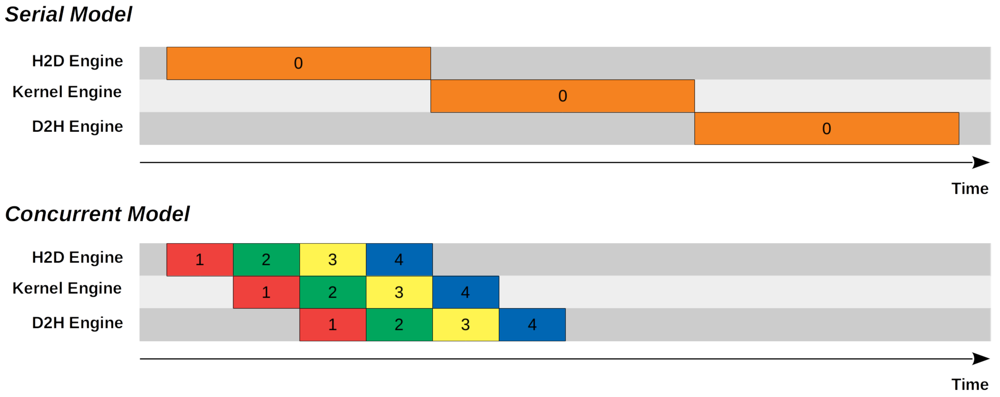
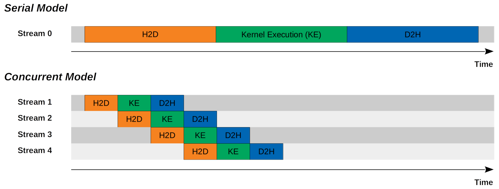

# 介绍

CUDA 内核非常强大，因为它可以利用 GPU 上大量的 CUDA 核心帮助我们异步解决可分解问题。在这里，我们使用“线程”的概念来异步执行内核。实际上，除了内核执行之外，我们还有两个额外的步骤来解决整个问题。这两个步骤是从主机到设备的内存复制和从设备到主机的内存复制。直观地说，我们首先将输入内存从主机复制到设备，然后执行内核来计算输出，最后将输出内存从设备复制回主机。但是，这种串行方法可能不是最佳的，因为我们可以通过同时执行从主机到设备的内存复制、内核执行和从设备到主机的内存复制来进一步提高性能。要做到这一点，我们需要理解“流”的概念。

# 示例模型

## 例子

最简单的 CUDA 程序由三个步骤组成，包括将内存从主机复制到设备、内核执行以及将内存从设备复制到主机。在我们的特定示例中，我们有以下事实或假设：

* 内存复制（主机到设备，设备到主机）的时间与复制的内存大小线性相关。
* GPU 永远不会得到充分利用。
* 内核执行可以分为 N 个较小的内核执行，每个较小的内核执行仅需原始内核执行所需时间的 1/N。
* 从主机到设备的内存复制时间、内核执行和从设备到主机的内存复制时间相同。
* 每个 CUDA 引擎按顺序执行命令或内核。
    
我们可以提出两个模型，包括串行模型和并发模型，来实现该程序。




# 串行模型与并发模型

## 串行模型

在串行模型中，我们首先将输入内存从主机复制到设备，然后执行内核计算输出，最后将输出内存从设备复制回主机。

## 并发模型
    
在并发模型中，我们使从主机到设备的内存复制、内核执行以及从设备到主机的内存复制异步化。我们将内存分成 `N` 个块（trunk）。在上面的特定示例中，我们设置 `N = 4`。完成将第一个块从主机复制到设备后，我们启动较小的内核执行来处理第一个块。与此同时，主机到设备 (H2D) 引擎变为可用，并继续将第二个块从主机复制到设备。一旦内核处理了第一个块，就会使用设备到主机引擎 (D2H) 引擎将输出内存从设备复制到主机。与此同时，主机到设备 (H2D) 引擎和内核引擎变为可用，它们继续将第三个块从主机复制到设备并分别处理第二个块。

从上图中我们可以看出并发模型只需要串行模型的一半的时间。那么现在问题就变成了如何编写 CUDA 程序，以便每个块的命令按顺序执行，并且不同的块可以同时执行。答案是使用 CUDA 流。

# CUDA 流

## 定义

根据[《CUDA 编程指南》](https://docs.nvidia.com/cuda/cuda-c-programming-guide/index.html#streams)，流是按顺序执行的一系列命令（可能由不同的主机线程发出）。另一方面，不同的流可能会彼此无序地或以并发方式执行命令。

这正是我们想要为我们的 CUDA 程序实现的并发模型。

## 默认流

根据CUDA 编程指南，内核启动、主机到设备内存复制以及未指定任何流参数（或将流参数设置为零）的设备到主机内存复制均发送到默认流。它也被称为`null`流或流 `0`。本质上，当我们调用 `cudaMemcpy` 或不指定流调用 `streamcudaMemcpyAsync` 时，我们就是在使用默认流。

随着新 CUDA 版本中的新功能，默认流的行为现在取决于编译标志。在传统模式下，默认流是与设备上的操作同步的流：在设备上的任何流中所有先前发出的操作完成之前，默认流中的任何操作都不会开始，并且默认流中的操作必须在任何其他操作（在设备上的任何流中）开始之前完成。因此，在传统模式下，默认流似乎对并发模型不友好，我们应该改用非默认流。

## 非默认流

必须声明、创建并最终销毁非默认 CUDA 流。

```cpp
cudaStream_t stream[nStreams];
for (int i = 0; i < nStreams; i ++)
{
    checkCuda(cudaStreamCreate(&stream[i]));
}
for (int i = 0; i < nStreams; i ++)
{
    checkCuda(cudaStreamDestroy(stream[i]));
}
```

为了实现并发模型，我们不再调用 `cudaMemcpy`，而是调用 `cudaMemcpyAsync` 并使用指定的 `stream` 启动内核，以便它们在调用后立即返回到主机线程。

```cpp
for (int i = 0; i < nStreams; i ++)
{
    int offset = i * streamSize;
    checkCuda(cudaMemcpyAsync(&d_a[offset], &a[offset], streamBytes, cudaMemcpyHostToDevice, stream[i]));
    kernel<<<streamSize/blockSize, blockSize, 0, stream[i]>>>(d_a, offset);
    checkCuda(cudaMemcpyAsync(&a[offset], &d_a[offset], streamBytes, cudaMemcpyDeviceToHost, stream[i]));
}
```

更多示例，请查看 [**Mark Harris** 的示例代码](https://github.com/NVIDIA-developer-blog/code-samples/blob/master/series/cuda-cpp/overlap-data-transfers/async.cu)。

# 带有 CUDA 流的示例模型

我们也可以从流的角度来看待串行模型和并发模型。



CUDA Stream：串行模型与并发模型

## 串行模型

我们只有一个（默认）CUDA 流。所有命令均按顺序执行。

## 并发模型

我们有 N 个（非默认）CUDA 流。同一流中的所有命令均按顺序执行。不同的流有重叠。

# 笔记

## 内核并发执行

只要计算资源充足，不同 CUDA 流上的内核执行可以同时运行。上面给出的模型图展示了一个理想模型，其中从主机到设备的内存复制时间、内核执行和从设备到主机的内存复制时间相同，因此可以使用最佳计算资源并实现最低延迟。不同 CUDA 流上的内核执行看起来是互斥的，但事实并非如此。实际上，不同 CUDA 流上的内核执行可能会有重叠。