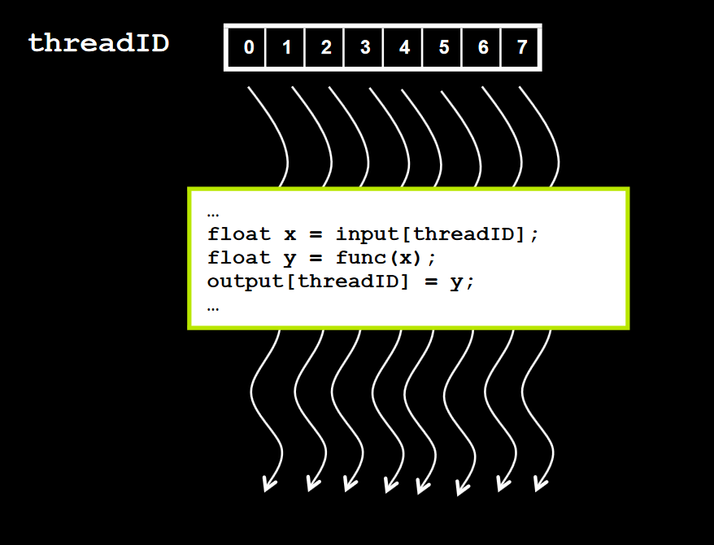
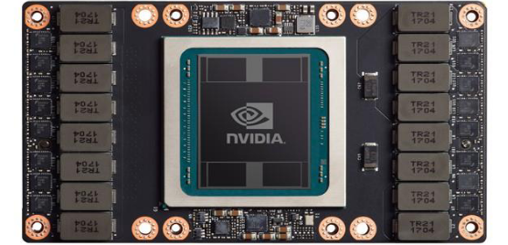
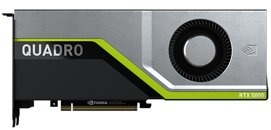

# GPU Characteristics（GPU 特性）

**原文：[Cornell University -> Cornell Virtual Workshop -> Understanding GPU Architecture -> GPU Characteristics](https://cvw.cac.cornell.edu/gpu-architecture/gpu-characteristics/index)**

The hardware design for graphics processing units (GPUs) is optimized for highly parallel processing. As a result, application programs for GPUs rely on programming models like NVIDIA CUDA that can differ substantially from traditional serial programming models based on CPUs. Still, one may ask: is the world of GPUs really so different from the world of CPUs? If one looks more closely, one discovers that many aspects of a GPU's architecture resemble those of modern CPUs, and the differences are at least partly a matter of terminology.

图形处理单元（GPU）的硬件设计优化了高度并行处理。因此，GPU的应用程序依赖于像NVIDIA CUDA这样的编程模型，与传统的基于CPU的串行编程模型有很大不同。尽管如此，人们可能会问：GPU的世界真的与CPU的世界如此不同吗？如果仔细研究，就会发现GPU的许多架构方面与现代CPU相似，差异至少部分是术语上的问题。

# Design: GPU vs. CPU（设计：GPU 与 CPU）

GPUs were originally designed to render graphics. They work very well for shading, texturing, and rendering the thousands of independent polygons that comprise a 3D object. CPUs, on the other hand, are meant to control the logical flow of any general-purpose program, where lots of number crunching may (or may not) be involved. Due to these very different roles, GPUs are characterized by many more processing units and higher aggregate memory bandwidth, while CPUs feature more sophisticated instruction processing and faster clock speed.

GPU最初是为渲染图形而设计的。它们非常适合着色、纹理化和渲染构成3D对象的数千个独立多边形。而CPU则是设计用来控制任何通用程序的逻辑流程，其中可能涉及（也可能不涉及）大量的数字计算。由于这些非常不同的作用，GPU的特点是拥有更多的处理单元和更高的总内存带宽，而CPU则具有更复杂的指令处理和更快的时钟速度。

The figure below illustrates the main differences in hardware architecture between CPUs and GPUs. The transistor counts associated with various functions are represented abstractly by the relative sizes of the different shaded areas. In the figure, green corresponds to computation; gold is instruction processing; purple is L1 cache; blue is higher-level cache, and orange is memory (DRAM, which should really be thousands of times larger than the caches).

下面的图表展示了CPU和GPU硬件架构之间的主要区别。与各种功能相关的晶体管数量通过不同阴影区域的相对大小抽象表示。在图表中，绿色代表计算；金色是指令处理；紫色是L1缓存；蓝色是更高级别的缓存，橙色是内存（DRAM，实际上应该比缓存大几千倍）。

Comparing the relative capabilities of the basic elements of CPU and GPU architectures.

This diagram, which is taken from the [CUDA C++ Programming Guide (v.11.2)](https://docs.nvidia.com/cuda/archive/11.2.0/pdf/CUDA_C_Programming_Guide.pdf), does not depict the actual hardware design of any particular CPU or GPU. However, based on the size, color, and number of the various blocks, the figure does suggest that:

这张图表取自CUDA C++编程指南（第11.2版），并不描绘任何特定CPU或GPU的实际硬件设计。然而，根据不同区域的大小、颜色和数量，该图表确实表明：

1.  CPUs can handle more complex workflows compared to GPUs.
2.  CPUs don't have as many arithmetic logic units or floating point units as GPUs (the small green boxes above, roughly speaking), but the ALUs and FPUs in a CPU core are individually more capable.
3.  CPUs have more cache memory than GPUs.

1.  CPU 可以处理比 GPU 更复杂的工作流程。
2.  CPU 没有 GPU 那么多的算术逻辑单元或浮点单元（上面的小绿盒，大致来说），但 CPU 核心中的 ALU 和 FPU 每个都更有能力。
3.  CPU 拥有比 GPU 更多的缓存内存。

A final point is that GPUs are really designed for workloads that can be parallelized to a significant degree. This is indicated in the diagram by having just one gold control box for every row of the little green computational boxes.

最后一点是，GPU确实设计用于能够显著并行化的工作负载。这在图表中通过每一行小绿计算盒有一个金色控制盒来表示。

# Performance: GPU vs. CPU（性能：GPU 与 CPU）

GPUs and CPUs are intended for fundamentally different types of workloads. CPUs are typically designed for multitasking and fast serial processing, while GPUs are designed to produce high computational throughput using their massively parallel architectures.

GPU和CPU旨在处理根本不同类型的工作负载。CPU通常设计用于多任务处理和快速串行处理，而GPU旨在使用其大规模并行架构产生高计算吞吐量。

The chart below, which is adapted from the [CUDA C Programming Guide (v.9.1)](https://docs.nvidia.com/cuda/archive/9.1/pdf/CUDA_C_Programming_Guide.pdf), shows the raw computational speed of different CPUs and GPUs. The purpose of the figure is to show the computational potential of GPUs, as measured in billions of floating-point operations per second (Gflop/s). One can ask: given a device that delivers such impressive floating-point performance, is it possible to use it for something besides graphics?

下面的图表，改编自 CUDA C 编程指南（第9.1版），展示了不同 CPU 和 GPU 的原始计算速度。该图表的目的是展示GPU的计算潜力，以每秒数十亿次浮点运算（Gflop/s）为单位。人们可能会问：给定一个设备能够提供如此出色的浮点性能，是否有可能将其用于除了图形以外的其他用途？

Peak performance in Gflop/s of GPUs and CPUs in single and double precision, 2009-2016.

> Info:

> Note, "single precision" refers to a 32-bit representation for floating point numbers (sometimes called FP32), while "double precision" refers to a 64-bit representation (FP64). Single precision numbers can often be processed twice as fast as the longer doubles.

> 信息：

> 注意，“单精度”指的是 32 位的浮点数表示（有时称为 FP32），而“双精度”指的是 64 位表示（FP64）。单精度数字通常可以比更长的双精度处理得快两倍。

# Heterogeneous Applications（异构应用程序）

It turns out that almost any application that relies on huge amounts of floating-point operations and simple data access patterns can gain a significant speedup using GPUs. This is sometimes referred to as GPGPU, or General-Purpose computing on Graphics Processing Units.

结果表明，几乎所有依赖大量浮点运算和简单数据访问模式的应用程序都可以利用GPU获得显著的加速。这有时被称为GPGPU，或者在图形处理单元上进行通用计算。

Historically, NVIDIA CUDA is one of the key enabling technologies for GPGPU. CUDA was among the first APIs to simplify the task of programming numerically intensive routines such as matrix manipulation, Fast Fourier Transforms, and decryption algorithms so they could be accelerated on GPUs. In the time since CUDA was introduced, a number of techniques have arisen to make GPGPU even easier for application programmers, including directive\-based methods such as OpenACC and OpenMP offloading.

历史上，NVIDIA CUDA 是 GPGPU 的关键使能技术之一。CUDA 是最早简化编程数值密集型例程（如矩阵操作、快速傅里叶变换和解密算法）以便在 GPU 上加速的 API 之一。自 CUDA 引入以来，出现了许多技术，使 GPGPU 对应用程序开发人员来说更容易，包括基于指令的方法如 OpenACC 和 OpenMP offloading。

The following are some of the scientific and engineering fields that have successfully used CUDA and NVIDIA GPUs to accelerate the performance of important applications:

以下是一些科学和工程领域，它们成功地使用 CUDA 和 NVIDIA GPU 加速了重要应用程序的性能：

- **Deep Learning - 深度学习**
- **Computational Fluid Dynamics - 计算流体动力学**
- **Computational Structural Mechanics - 计算结构力学**
- **Seismic Processing - 地震处理**
- **Bioinformatics - 生物信息学**
- **Materials Science - 材料科学**
- **Molecular Dynamics - 分子动力学**
- **Quantum Chemistry - 量子化学**
- **Computational Physics - 计算物理学**

Numerous examples of applications in the above areas can be found in the NVIDIA document [GPU-Accelerated Applications](https://www.nvidia.com/en-us/gpu-accelerated-applications/).

在 NVIDIA 文档 GPU-Accelerated Applications 中可以找到以上领域的许多应用程序的示例。

Of course, GPUs are hosted on CPU-based systems. Given a heterogeneous computer containing both CPUs and GPUs, it may be a good strategy to offload the massively parallel and numerically intensive tasks to one or more GPUs. Since most HPC applications contain both highly parallel and less-parallel parts, adopting a heterogeneous programming model is frequently the best way to utilize the strengths of both GPUs and CPUs. It allows the application to take advantage of the highly parallel GPU hardware to produce higher overall computational throughput.

当然，GPU 是宿主在基于 CPU 的系统上。鉴于包含 CPU 和 GPU 的异构计算机，将大规模并行和数值密集型任务卸载到一个或多个 GPU 上可能是一个好策略。由于大多数 HPC 应用程序包含高度并行和不太平行的部分，采用异构编程模型通常是利用 GPU 和 CPU 优势的最佳方式。它允许应用程序利用高度并行的 GPU 硬件产生更高的总体计算吞吐量。

In heterogeneous systems, the GPUs can be supplied through standard graphics cards, such as the NVIDIA Quadro, or through high-end accelerator cards, such as the NVIDIA Tesla. The Tesla comes with extra processing power, double-precision capability, special memory, and other features to make it even more favorable for HPC. But NVIDIA devices of both kinds are capable of accelerating a variety of computational tasks, e.g., half-precision arithmetic for machine learning.

在异构系统中，GPU 可以通过标准图形卡供应，如 NVIDIA Quadro，或通过高端加速卡，如 NVIDIA Tesla。Tesla 提供了额外的处理能力，双精度能力，特殊内存和其他功能，使其更适合 HPC。但 NVIDIA 的两种设备类型都能够加速各种计算任务，例如机器学习的半精度算术。

Either way, GPUs may outperform CPU-based processors by quite a lot, assuming the application is able to make full use of the hardware's inherent parallelism. As we will see, in TACC's Frontera system, the raw speed of single-precision computations in one of its CPU-based Intel "Cascade Lake" processors—specifically, an Intel Xeon Platinum 8280—is 4.3 Tflop/s; whereas just one of its GPUs, a Quadro RTX 5000, can potentially reach 11.2 Tflop/s, and a single one of the Tesla V100s in the companion Longhorn system (now decommissioned) might go as high as 15.7 Tflop/s.

不管怎样，GPU 可能会比基于 CPU 的处理器性能高出很多，假设应用程序能够充分利用硬件的固有并行性。正如我们将看到的，在 TACC 的 Frontera 系统中，其基于 CPU 的Intel "Cascade Lake"处理器之一——特别是 Intel Xeon Platinum 8280 —— 的单精度计算原始速度为 4.3 Tflop/s；而其中的一个 GPU，Quadro RTX 5000，可能达到 11.2 Tflop/s，而配套的 Longhorn 系统（现已退役）中的一个 Tesla V100 可能高达 15.7 Tflop/s。

# Threads and Cores Redefined

What is the secret to the high performance that can be achieved by a GPU? The answer lies in the graphics pipeline that the GPU is meant to "pump": the sequence of steps required to take a scene of geometrical objects described in 3D coordinates and render them on a 2D display.

Two key properties of the graphics pipeline permit its speed to be accelerated. First, a typical scene is composed of many independent objects (e.g., a mesh of tiny triangles approximating a surface). Second, the sequence of steps needed to render each of the objects is basically the same for all of the objects, so that the computational steps may be performed in parallel on all them at once. By their very nature, then, GPUs must be highly capable parallel computing engines.

But CPUs, too, have evolved to become highly capable parallel processors in their own right—and in this evolution, they have acquired certain similarities to GPUs. Therefore, it is not surprising to find a degree of overlap in the terminology used to describe the parallelism in both kinds of processors. However, one should be careful to understand the distinctions as well, because the precise meanings of terms can differ signficantly between the two types of devices.

For example, with CPUs as well as GPUs, one may speak of **_threads_** that run on different **_cores_**. In both cases, one envisions distinct _streams of instructions_ that are scheduled to run on different _execution units_. Yet the ways in which _threads_ and _cores_ act upon data are quite different in the two cases.

It turns out that a single core in a GPU—which we'll call a **_CUDA core_** hereafter, for clarity—is much more like a single vector lane in the vector processing unit of a CPU. Why? Because CUDA cores are essentially working in teams of 32 to execute a [Single Instruction on Multiple Data](https://cvw.cac.cornell.edu/parallel/hpc/taxonomy-parallel-computers), a type of parallelism known as SIMD. In CPUs, SIMD operations are possible as well, but they are carried out by vector units, based on smaller data groupings (typically 8 or 16 elements).

The table below attempts to reduce the potential sources of confusion. It lists and defines the terms that apply to the various levels of parallelism in a GPU, and gives their rough equivalents in CPU terminology. (Several new terms are introduced below; they are further explained on succeeding pages.)

| **GPU term**                     | **Quick definition for a GPU**                                                                                                                                                                                                                | **CPU&nbsp;equivalent** |
|----------------------------------|-----------------------------------------------------------------------------------------------------------------------------------------------------------------------------------------------------------------------------------------------|-------------------------|
| **thread**                       |                          The stream of instructions and data that is assigned to one CUDA core; note, a Single Instruction applies                          to Multiple Threads, acting on multiple data (SIMT)                      | N/A                     |
| **CUDA core**                    | Unit that processes one data item after another, to execute its portion of a SIMT instruction stream                                                                                                                                          | vector lane             |
| **warp**                         | Group of 32 threads that executes the same stream of instructions together, on different data                                                                                                                                                 | vector                  |
| **kernel**                       | Function that runs on the device; a kernel may be subdivided into thread blocks                                                                                                                                                               | **thread(s)**               |
| **SM, streaming multiprocessor** | Unit capable of executing a thread block of a kernel; multiple SMs may work together on a kernel                                                                                                                                              | **core**                    |

Comparison of terminology between GPUs and CPUs.

# SIMT and Warps

On the preceding page we encountered two new GPU\-related terms, SIMT and warp. Let's explore their meanings and implications more thoroughly.

## SIMT

As you might expect, the NVIDIA term "Single Instruction Multiple Threads" (SIMT) is closely related to a better known term, Single Instruction Multiple Data (SIMD). What's the difference? In pure SIMD, a single instruction acts upon _all_ the data in _exactly_ the same way. In SIMT, this restriction is loosened a bit: selected threads can be activated or deactivated, so that instructions and data are processed only on the active threads, while the local data remain unchanged on inactive threads.

As a result, SIMT can accommodate branching, though not very efficiently. Given an _if-else_ construct beginning with _if (condition)_, the threads for which _condition==true_ will be active when running statements in the _if_ clause, and the threads for which _condition==false_ will be active when running statements in the _else_ clause. The results should be correct, but the inactive threads will do no useful work while they are waiting for statements in the active clause to complete. Branching within SIMT is illustrated in the figure below.

How an if-else is executed in the Volta implementation of SIMT.

The figure, like several others in this topic, is taken from NVIDIA's [Volta architecture whitepaper](https://images.nvidia.com/content/volta-architecture/pdf/volta-architecture-whitepaper.pdf). It illustrates how an _if-else_ construct can be executed by a recent GPU such as the Tesla V100 (or later).

> Info:

> Note that in NVIDIA GPUs prior to Volta, the entire _if_ clause (i.e., both statements A and B) would have to be executed by the relevant threads, then the entire _else_ clause (both statements X and Y) would have to be executed by the remainder of the threads, then all threads would have to synchronize before continuing execution (statement Z). Volta's more flexible SIMT model permits synchronization of shared data at intermediate points (say, after A and X).

It is worth observing that a form of SIMT also exists on CPUs. Many vector instructions in Intel's x86\_64 have masked variants, in which a vector instruction can be turned on/off for selected vector lanes according to the true/false values in an extra vector operand. This extra operand is called a "mask" because it functions like one: it "hides" certain vector lanes. And the masking trick enables branching to be vectorized on CPUs, too, to a limited extent.

In contrast to how CPU code is written, SIMT parallelism on the GPU does not have to be expressed through "vectorized loops". Instead—at least in CUDA—every GPU thread executes the kernel code as written. This somewhat justifies NVIDIA's "thread" nomenclature.

> Info:

> Note that GPU code can also be written by applying OpenMP or OpenACC directives to loops, in which case it can end up looking very much like vectorized CPU code.

## Warps

At runtime, a block of threads is divided into warps for SIMT execution. One full warp consists of a bundle of 32 threads with consecutive thread indexes. The threads in a warp are then processed together by a set of 32 CUDA cores. This is analogous to the way that a vectorized loop on a CPU is chunked into vectors of a fixed size, then processed by a set of vector lanes.

The reason for bundling threads into warps of 32 is simply that in NVIDIA's hardware, CUDA cores are divided into fixed groups of 32. Each such group is analogous to a vector processing unit in a CPU. Breaking down a large block of threads into chunks of this size simplifies the SM's task of scheduling the entire thread block on its available resources.

Apparently NVIDIA borrowed the term "warp" from weaving, where it refers to the set of vertical threads through which the weaver's shuttle passes. To quote the [original paper by Lindholm et al.](https://ieeexplore.ieee.org/document/4523358) that introduced SIMT, "The term _warp_ originates from weaving, the first parallel-thread technology." (NVIDIA continues to use this quote in their [CUDA C++ Programming Guide](https://docs.nvidia.com/cuda/cuda-c-programming-guide/index.html#simt-architecture).)

One could argue that the existence of warps is a hardware detail that isn't directly relevant to application programmers. However, the warp-based execution model has implications for performance that can influence coding choices. For example—as the figure above illustrates—branching can complicate the execution flow of a warp, if two threads in the same warp branch to different instructions. Thus, a programmer might want to avoid branching within warp-sized sets of loop iterations.

# Kernels and SMs

We continue our survey of GPU-related terminology by looking at the relationship between kernels, thread blocks, and streaming multiprocessors (SMs).

## Kernels (in software)

A function that is meant to be executed in parallel on an attached GPU is called a _kernel_. In CUDA, a kernel is usually identified by the presence of the `__global__` specifier in front of an otherwise normal-looking C++ function declaration. The designation `__global__` means the kernel may be called from either the host or the device, but it will execute on the device.

Instead of being executed only once, a kernel is executed N times in parallel by N different threads on the GPU. Each thread is assigned a unique ID (in effect, an index) that it can use to compute memory addresses and make control decisions.

Showing how a CUDA kernel is executed by an array of threads.  
Source: [NVIDIA CUDA Zone](https://www.nvidia.com/content/cudazone/download/Getting_Started_w_CUDA_Training_NVISION08.pdf)

Accordingly, kernel calls must supply special arguments specifying how many threads to use on the GPU. They do this using CUDA's "execution configuration" syntax, which looks like this: `fun<<<1, N>>>(x, y, z)`. Note that the first entry in the configuration (1, in this case) gives the number of _blocks_ of N threads that will be launched.

## Streaming multiprocessors (in hardware)

On the GPU, a kernel call is executed by one or more streaming multiprocessors, or SMs. The SMs are the hardware homes of the CUDA cores that execute the threads. The CUDA cores in each SM are always arranged in sets of 32 so that the SM can use them to execute full warps of threads. The exact number of SMs available in a device depends on its NVIDIA processor family (Volta, Turing, etc.), as well as the specific model number of the processor. Thus, the Volta chip in the Tesla V100 has 80 SMs in total, while the more recent Turing chip in the Quadro RTX 5000 has just 48.

However, the number of SMs that the GPU will actually use to execute a kernel call is limited to the number of thread _blocks_ specified in the call. Taking the call `fun<<<M, N>>>(x, y, z)` as an example, there are at most M blocks that can be assigned to different SMs. A thread block may not be split between different SMs. (If there are more blocks than available SMs, then more than one block may be assigned to the same SM.) By distributing blocks in this manner, the GPU can run independent blocks of threads in parallel on different SMs.

Each SM then divides the N threads in its current block into warps of 32 threads for parallel execution internally. On every cycle, each SM's schedulers are responsible for assigning full warps of threads to run on available sets of 32 CUDA cores. (The Volta architecture has 4 such schedulers per SM.) Any leftover, partial warps in a thread block will still be assigned to run on a set of 32 CUDA cores.

The SM includes several levels of memory that can be accessed only by the CUDA cores of that SM: registers, L1 cache, constant caches, and shared memory. The exact properties of the per-SM and global memory available in Volta GPUs will be outlined shortly.

# Compute Capability

The technical properties of the SMs in a particular NVIDIA GPU are represented collectively by a version number called the _compute capability_ of the device. This serves as a reference to the set of features that is supported by the GPU. It can even be discovered by applications at run time to find out whether certain hardware properties and/or instructions are present on the GPU.

Devices with the same first number in their compute capability share the same core architecture. For example, if a device's compute capability starts with a 7, it means that the GPU is based on the Volta architecture; 8 means the Ampere architecture; and so on. Minor version numbers correspond to incremental improvements to the base architecture. For instance, Turing is assigned a compute capability of 7.5 because it is an incremental update of the Volta architecture.

NVIDIA Tesla V100, based on the Volta architecture, and NVIDIA Quadro RTX 5000, based on the Turing architecture.

Are you thinking about writing CUDA programs for the NVIDIA graphics card in your personal computer? First, make sure this is a real possibility by searching through the lists of [GPUs that are enabled for CUDA](https://developer.nvidia.com/cuda-gpus#compute). If your card is listed, then note its compute capability, because this number lets you learn all kinds of things about the [features and technical specifications](https://docs.nvidia.com/cuda/cuda-c-programming-guide/index.html#compute-capabilities) of your GPU (much more than a beginner needs to know).