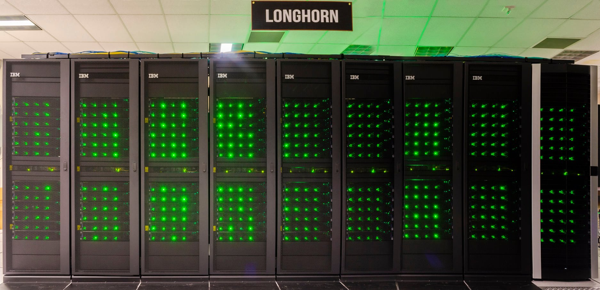
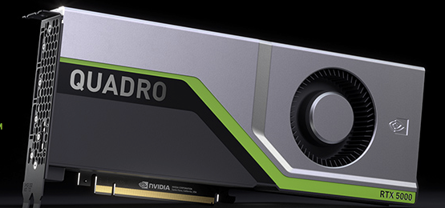

# GPU Example: RTX 5000

**原文：[Cornell University -> Cornell Virtual Workshop -> Understanding GPU Architecture -> GPU Example: RTX 5000](https://cvw.cac.cornell.edu/gpu-architecture/gpu-example-tesla-v100/index)**

It's fine to have a general understanding of what graphics processing units can be used for, and to know conceptually how they work. But at the actual hardware level, what does a particular GPU consist of, if one peeks "under the hood"? Sometimes the best way to learn about a certain type of device is to consider one or two concrete examples. Here we'll be taking a detailed look at the Quadro RTX 5000, a GPU which is found in TACC's Frontera. In a previous topic, we did a similar deep dive into the [Tesla V100](tesla_v100.md), one of the NVIDIA models that has been favored for HPC applications.

大致了解图形处理单元的用途，并从概念上了解它们的工作原理，这很好。但在实际的硬件层面，如果深入了解，特定 GPU 由什么组成？有时，了解某种设备的最佳方法是考虑一两个具体示例。在这里，我们将详细介绍 Quadro RTX 5000，这是 TACC Frontera 中的一款 GPU。在上一个主题中，我们对 [Tesla V100](tesla_v100.md) 进行了类似的深入研究，这是 NVIDIA 型号之一，在 HPC 应用方面备受青睐。

# Frontera's GPU Subsystems

Tesla V100 servers in the former Longhorn subsystem of Frontera.

At inception, the leadership-class Frontera system at the Texas Advanced Computing Center included two GPU subsystems. The one shown in the top figure, called "Longhorn", was suitable for double-precision work. Prior to its decommissioning in 2022, it had over 400 NVIDIA Tesla V100 GPU accelerators hosted in 100+ IBM POWER9-based AC922 servers, with 4 GPUs per server. A full account of the properties of the Tesla V100 is found in a [prior topic](tesla_v100.md) of the Understanding GPU Architecture. The remaining subsystem, which can be accessed via special queues on Frontera, consists of 360 NVIDIA Quadro RTX 5000 graphics cards hosted in Dell/Intel Broadwell-based servers, again featuring 4 GPUs per server. Frontera's original pair of GPU subsystems combined to contribute 11 petaflop/s of single precision computing power to Frontera, serving to accelerate artificial intelligence, machine learning, and molecular dynamics research.

德克萨斯高级计算中心的领先级 Frontera 系统在成立之初就包含两个 GPU 子系统。上图所示的系统名为“Longhorn”，适用于双精度工作。在 2022 年退役之前，它拥有 400 多个 NVIDIA Tesla V100 GPU 加速器，托管在 100 多台基于 IBM POWER9 的 AC922 服务器中，每台服务器有 4 个 GPU。Tesla V100 属性的完整说明可在“了解 GPU 架构”的 [先前主题](tesla_v100.md) 中找到。其余子系统可通过 Frontera 上的特殊队列访问，由 360 个 NVIDIA Quadro RTX 5000 显卡组成，托管在基于 Dell/Intel Broadwell 的服务器中，同样每台服务器有 4 个 GPU。Frontera 最初的一对 GPU 子系统合计为 Frontera 贡献了 11 petaflop/s 的单精度计算能力，用于加速人工智能、机器学习和分子动力学研究。

Quadro RTX 5000 servers at TACC with liquid cooling by GRC.

Interestingly, due to the very high concentrations of heat-generating computing power, Frontera's design includes special features to cool its components so they can run at top speed. Nearly all its racks and servers are water cooled, since standard air cooling with fans would be insufficient. The NVIDIA Quadros in particular are cooled in a very unusual way: as shown in the second figure, they are completely submerged in baths of liquid coolant, a solution developed by GRC. (The V100s in the former Longhorn subsystem happened to be air-cooled. However, if Longhorn had possessed 6 V100s per node instead of 4, then the water-cooled variant of the IBM AC922 servers would have been required.)

有趣的是，由于计算能力的发热非常高，Frontera 的设计包括特殊功能来冷却其组件，以便它们能够以最高速度运行。几乎所有机架和服务器都采用水冷，因为标准的带风扇的空气冷却是不够的。NVIDIA Quadros 的冷却方式尤其不寻常：如第二张图所示，它们完全浸没在液体冷却剂槽中，这是 GRC 开发的解决方案。（前 Longhorn 子系统中的 V100 恰好是空气冷却的。但是，如果 Longhorn 每个节点拥有 6 个 V100 而不是 4 个，那么就需要 IBM AC922 服务器的水冷版本。）

In the pages to come, we'll be taking a deep dive into the RTX 5000, to see what makes it attractive for doing GPGPU.

在接下来的内容中，我们将深入研究 RTX 5000，看看它为何适合用作 GPGPU。

# NVIDIA Quadro RTX 5000

TACC's Frontera also offers a subsystem equipped with NVIDIA Quadro RTX 5000 graphics cards. These devices are based on NVIDIA's Turing microarchitecture, which is the next generation after Volta. Even so, for HPC purposes, the Quadros are individually less capable than the Tesla V100s in Frontera's former Longhorn subsystem.

TACC 的 Frontera 还提供配备 NVIDIA Quadro RTX 5000 显卡的子系统。这些设备基于 NVIDIA 的 Turing 微架构，这是继 Volta 之后的下一代。即便如此，对于 HPC 而言，Quadros 的性能仍不如 Frontera 以前的 Longhorn 子系统中的 Tesla V100。

If one looks in detail at the TU104 chip that lies at the heart of a Quadro RTX 5000, one sees that its Streaming Multiprocessors (SMs) are missing the CUDA cores for processing FP64 data. And even though a single Turing SM has the exact same number of FP32 and INT32 CUDA cores as a single Volta SM (64 for each datatype), the Quadro RTX 5000 has far fewer SMs overall: just 48 in total, as compared to the 80 SMs in the Tesla V100.

如果仔细观察 Quadro RTX 5000 的核心 TU104 芯片，就会发现其流式多处理器 (SM) 缺少用于处理 FP64 数据的 CUDA 核心。尽管单个 Turing SM 的 FP32 和 INT32 CUDA 核心数量与单个 Volta SM 完全相同（每种数据类型 64 个），但 Quadro RTX 5000 的 SM 总数要少得多：总共只有 48 个，而 Tesla V100 有 80 个 SM。

Accordingly, the peak FP32 performance of the Quadro is significantly below the 15.7 teraflop/s of the Tesla V100, despite the Quadro's faster Boost Clock:

因此，尽管 Quadro 的 Boost Clock 速度更快，但其峰值 FP32 性能明显低于 Tesla V100 的 15.7 teraflop/s：

$$
3072 \text{ CUDA cores} \times 2 \frac{\text{flop}}{\text{core/cycle}} \times 1.815 \frac{\text{Gcycle}}{\text{s}} \approx 11.2 \frac{\text{Tflop}}{\text{s}}
$$

The extra factor of 2 is included to account for the possibility of a fused multiply-add (FMA) on every cycle.

包含额外的因子 2 来解释每个周期发生融合乘加 (FMA) 的可能性。

NVIDIA Quadro RTX 5000.

The TU104 also has a way to perform FMAs on FP64 data, but since it lacks dedicated CUDA cores for the purpose, it can only do so at the drastically reduced rate of 2 results/cycle/SM. You may refer to NVIDIA's [CUDA Programming Guide](https://docs.nvidia.com/cuda/cuda-c-programming-guide/index.html#arithmetic-instructions) for a full rundown of the throughput for different arithmetic instructions, based on the the compute capability of the device. (The TU104 has a compute capability of 7.5: footnote 5 of Table 3 is where to find the FMA rate for GPUs of that rating.)

TU104 还可以对 FP64 数据执行 FMA，但由于它缺少专用的 CUDA 核心，因此只能以大幅降低的 2 个结果/周期/SM 的速率执行此操作。您可以参考 NVIDIA 的 [CUDA 编程指南](https://docs.nvidia.com/cuda/cuda-c-programming-guide/index.html#arithmetic-instructions)，根据设备的计算能力，全面了解不同算术指令的吞吐量。（TU104 的计算能力为 7.5：表 3 的脚注 5 是查找该等级 GPU 的 FMA 速率的位置。）

The above calculation of FP32 peak performance does not mean that the Quadro RTX 5000 is inferior to the Tesla V100; it just means that the Quadro was primarily designed as a high-end graphics card. One could consider other kinds of metrics, too, such as flop/s/watt and cost/(flop/s), which might make the RTX 5000 an attractive component of HPC systems.

上述 FP32 峰值性能计算并不意味着 Quadro RTX 5000 不如 Tesla V100；它只是意味着 Quadro 主要设计为高端显卡。人们还可以考虑其他类型的指标，例如每秒浮点运算次数/瓦特和每秒浮点运算次数成本，这可能会使 RTX 5000 成为 HPC 系统的一个有吸引力的组件。

# Turing Block Diagram

Superficially, the block diagram of the Turing TU104 chip (below) has a hierarchy very similar to that of the GV100. The 48 SMs are paired up into 24 Texture Processing Clusters, which are divided into 6 GPU Processing Clusters.

从表面上看，Turing TU104 芯片的框图（下图）具有与 GV100 非常相似的层次结构。48 个 SM 配对成 24 个纹理处理群集，这些群集又分为 6 个 GPU 处理群集。

Turing TU104 block diagram.

But the TU104 features a number of elements that are not found at all in a GV100, because each cluster or level in the hierarchy is home to a special type of processing unit that accomplishes a certain step in the graphics pipeline. The table below shows the special units that are associated with different blocks in the TU104 block diagram:

但是 TU104 具有许多 GV100 中没有的元素，因为层次结构中的每个集群或级别都包含一种特殊类型的处理单元，用于完成图形管道中的某个步骤。下表显示了与 TU104 框图中不同块相关联的特殊单元：

The association between the blocks (or cluster levels) in the block diagram and the special units found in an RTX 5000.

框图中的块（或集群级别）与 RTX 5000 中的特殊单元之间的关联。

| **Block Name** | **Associated Special Unit** | **Count in TU104** |
|----------------|-----------------------------|--------------------|
| **SM**         | Ray Tracing Core            | 48                 |
| **TPC**        | PolyMorph Engine            | 24                 |
| **GPC**        | Raster Engine               | 6                  |

In addition, each Memory Controller has associated with it a set of 8 Render Output units (or ROPs, displayed near the L2 cache in the above diagram). Since there are 8 memory controllers, in all, the TU104 has a total of 64 ROPs.

此外，每个内存控制器都与一组 8 个渲染输出单元（或 ROP，显示在上图中的 L2 缓存附近）相关联。由于有 8 个内存控制器，因此 TU104 总共有 64 个 ROP。

For applications that just want to use the GPU to crunch numbers, these special graphics features have no particular importance, other than as an aid in understanding why the hierarchical arrangement of the SMs exists in the first place.

对于只想使用 GPU 来处理数字的应用程序来说，这些特殊的图形功能并没有特别的重要性，除了有助于理解为什么 SM 的层次结构存在。

# Inside a Turing SM

NVIDIA Turing Streaming Multiprocessor (SM) block diagram.

Let's zoom in on one of the streaming multiprocessors depicted in the diagram on the previous page. Each Turing SM gets its processing power from:

让我们放大上一页图表中描绘的流式多处理器之一。每个 Turing SM 的处理能力来自：

*   Sets of CUDA cores for the following datatypes
    *   64 FP32 CUDA cores
    *   64 INT32 CUDA cores
*   8 Turing Tensor Cores
*   16 Special Function Units
*   4 Texture Units
*   1 Ray Tracing core (RT core)

* 适用于以下数据类型的 CUDA 核心集
    * 64 个 FP32 CUDA 核心
    * 64 个 INT32 CUDA 核心
* 8 个 Turing Tensor 核心
* 16个特殊功能单元
* 4 个纹理单元
* 1 个光线追踪核心（RT 核心）

Just like the SMs in Volta GPUs, a Turing SM is partitioned into 4 processing blocks, as shown in the figure. This flexible layout allows the CUDA cores to schedule up to 2 warps of FP32 or INT32 (possibly 1 of each) for processing on every cycle. But unlike the V100, the Turing T4 does not possess FP64 capability.

就像 Volta GPU 中的 SM 一样，Turing SM 被划分为 4 个处理块，如图所示。这种灵活的布局允许 CUDA 核心在每个周期内调度最多 2 个 FP32 或 INT32 的 warp（可能各 1 个）进行处理。但与 V100 不同，Turing T4 不具备 FP64 功能。

Data are supplied to the bulk of this hardware through 16 Load/Store units (as compared to 32 for a Volta SM). These Load/Store units appear at the bottom of each processing block, above.

数据通过 16 个加载/存储单元（而 Volta SM 有 32 个）提供给该硬件的大部分。这些加载/存储单元出现在每个处理块的底部（如上图所示）。

Turing Tensor Cores offer a range of precisions for deep learning training and inference, from FP32 and FP16 to INT8 and even INT4. Turing's multi-precision computing capability advances NVIDIA's Tensor Core technology beyond Volta and enables even more efficient AI inference.

Turing Tensor Cores 为深度学习训练和推理提供了一系列精度，从 FP32 和 FP16 到 INT8 甚至 INT4。Turing 的多精度计算能力使 NVIDIA 的 Tensor Core 技术超越 Volta，并实现更高效的 AI 推理。

The special Ray Tracing core, though it is an interesting feature, does not typically enter into GPGPU applications. Therefore, its capabilities will not be described here.

特殊的光线追踪核心虽然是一项有趣的功能，但通常不会出现在 GPGPU 应用程序中。因此，这里就不描述它的功能了。

# RTX 5000 Memory & PCIe 3.0

Unlike the Tesla V100, the Quadro RTX 5000 does not come with special 3D stacked memory. Instead, it has 16 GB of the latest generation of graphics memory, GDDR6 SDRAM. And thanks to its 8 memory controllers, the RTX 5000 achieves a healthy peak memory bandwidth of 448 GB/s.

与 Tesla V100 不同，Quadro RTX 5000 没有配备特殊的 3D 堆叠内存。相反，它拥有 16 GB 的最新一代图形内存 GDDR6 SDRAM。得益于其 8 个内存控制器，RTX 5000 实现了 448 GB/s 的健康峰值内存带宽。

While the above memory size and performance amounts to only half of the 32 GB and 900 GB/s rating of the HBM2 memory in the V100, it should be noted that the RTX 5000 also possesses only 60% as many SMs as its beefier cousin. Similarly, its L2 cache is 4 MB in size, which is proportionally smaller that the 6 MB L2 in the V100. Therefore, in terms of quantity and speed of memory _per SM_, the two devices are roughly on a par with each other.

虽然上述内存大小和性能仅为 V100 中 HBM2 内存 32 GB 和 900 GB/s 额定值的一半，但需要注意的是，RTX 5000 的 SM 数量也仅为其更强大的同类产品的 60%。同样，它的 L2 缓存大小为 4 MB，与 V100 中的 6 MB L2 相比，比例较小。因此，就每 SM 的内存数量和速度而言，这两款设备大致相当。

The exception to this is the L1 cache and shared memory in each SM of the RTX 5000, which is only 75% as big as the same unified data cache in the V100 (96 KB vs. 128 KB). The table below gives a full side-by-side summary of the memory hierarchies and compute power in the two devices.

例外情况是 RTX 5000 每个 SM 中的 L1 缓存和共享内存，其大小仅为 V100 中相同统一数据缓存的 75%（96 KB vs. 128 KB）。下表并列总结了两个设备中的内存层次结构和计算能力。

Comparison of the memory hierarchies and computing capabilities  
of the Quadro RTX 5000 and the Tesla V100.

内存层次和计算能力的比较  
Quadro RTX 5000 和 Tesla V100。

|                                         | **Quadro RTX 5000** | **Tesla V100** |
|-----------------------------------------|---------------------|----------------|
| **Main Memory Type**                    | GDDR6 SDRAM         | HBM2           |
| **Error Correction Code (ECC) Memory**  | yes                 | yes            |
| **Main Memory Size**                    | 16 GB               | 32 GB          |
| **Main Memory Bandwidth**               | 448 GB/s            | 900 GB/s       |
| **L2 Cache Size**                       | 4 MB                | 6 MB           |
| **Shared Memory + L1 Cache Size**       | 96 K                | 128 K          |
| **Streaming Multiprocessors (SMs)**     | 48                  | 80             |
| **FP32/INT32/FP64 CUDA Cores (per SM)** | 64/64/0             | 64/64/32       |
| **Tensor Cores (per SM)**               | 8                   | 8              |
| **GPU Boost Clock**                     | 1.815 GHz           | 1.53 GHz       |

What about moving data back and forth to the host? Each of the 4 Quadros in a Frontera node is linked to the host via a separate x16 PCI Express (PCIe) 3.0 bus, which has a bidirectional bandwidth of up to 32 GB/s. While this set of connections seems more than adequate, PCIe nevertheless has the potential to become a major bottleneck for tasks involving lots of memory transactions between the host and the devices.

那么如何将数据来回移动到主机呢？Frontera 节点中的 4 个 Quadro 中的每一个都通过单独的 x16 PCI Express (PCIe) 3.0 总线连接到主机，该总线的双向带宽高达 32 GB/s。虽然这组连接似乎绰绰有余，但 PCIe 仍有可能成为涉及主机和设备之间大量内存事务的任务的主要瓶颈。

The limitation becomes especially apparent if one compares PCIe3 x16 to the NVLink 2.0 connections [described earlier for the Tesla V100](tesla_v100.md). A single V100 actually has 6 links available to use, and each of these is capable of 50 GB/s (bidirectional). If all 6 are connected to the host, then the total NVLink 2.0 bidirectional bandwidth climbs to 300 GB/s, almost an order of magnitude greater than the 32 GB/s of PCIe3. However, [as discussed previously](tesla_v100.md), the NVLink bandwidth of each V100 in the IBM AC922 server is split between the host and a neighboring V100, so that each gets 150 GB/s.

如果将 PCIe3 x16 与 [之前针对 Tesla V100 描述的](tesla_v100.md) 的 NVLink 2.0 连接进行比较，这种限制就变得尤为明显。单个 V100 实际上有 6 条链路可供使用，每条链路的速率可达 50 GB/s（双向）。如果所有 6 条链路都连接到主机，则 NVLink 2.0 的总双向带宽将攀升至 300 GB/s，几乎比 PCIe3 的 32 GB/s 高出一个数量级。但是，[如前所述](tesla_v100.md)，IBM AC922 服务器中每个 V100 的 NVLink 带宽在主机和相邻的 V100 之间分配，因此每个 V100 的速率为 150 GB/s。

It turns out that the Quadro RTX 5000 possesses NVLink 2.0 capability, too, but it has only a single 50 GB/s link to work with. In Frontera, this spare link is used to couple the Quadros together within each server, so that the 4 Quadros are linked in pairs in a manner similar to the 4 V100s in the IBM AC922, but with lower total bandwidth in each connection.

事实证明，Quadro RTX 5000 也具备 NVLink 2.0 功能，但它只有一个 50 GB/s 的链路可供使用。在 Frontera 中，这个备用链路用于将每台服务器内的 Quadro 连接在一起，这样 4 个 Quadro 就以类似于 IBM AC922 中的 4 个 V100 的方式成对连接，但每个连接的总带宽较低。

Comparison of the connection types and speeds  
of the Quadro RTX 5000 and the Tesla V100.

连接类型和速度的比较  
Quadro RTX 5000 和 Tesla V100。

|                                             | **Quadro RTX 5000** | **Tesla V100 (IBM host)** |
|---------------------------------------------|---------------------|---------------------------|
| **Host-to-Device Connection Type**          | 1 PCIe Gen 3 (x16)  | 3 NVLink 2.0 (x8)         |
| **Host-to-Device Bidirectional Bandwidth**  | 32 GB/s             | 150 GB/s                  |
| **Peer-to-Peer Connection Type (per pair)** | 1 NVLink 2.0 (x8)   | 3 NVLink 2.0 (x8)         |
| **Peer-to-Peer Bidirectional Bandwidth**    | 50 GB/s             | 150 GB/s                  |

Tests on Frontera show that the peer-to-peer link between a pair of RTX 5000 GPUs actually tends to run slower than the PCIe3 link to the host, even though the peer-to-peer link rate is nominally faster, as seen in the above table. The NVLink 2.0 latency is better than the PCIe3 latency, however. You can test these claims for yourself later, in the [bonus exercise](exer_device_bandwidth.md).

Frontera 上的测试表明，一对 RTX 5000 GPU 之间的点对点链接实际上往往比 PCIe3 到主机的链接运行速度慢，尽管点对点链接速率名义上更快，如上表所示。然而，NVLink 2.0 延迟优于 PCIe3 延迟。您可以稍后在 [奖励练习](exer_device_bandwidth.md) 中亲自测试这些说法。

There are at least two ways to overcome the bandwidth limitations of the Quadro RTX 5000: maximize the on-device memory usage, and overlap data transfers with other tasks. In particular, if you know that a task requires more than 5GB of memory, you can minimize the memory transfer overhead by streaming data to the device while other tasks are running (hence the name "streaming multiprocessor" in GPUs).

至少有两种方法可以克服 Quadro RTX 5000 的带宽限制：最大化设备上的内存使用率，以及与其他任务重叠数据传输。具体来说，如果您知道某项任务需要超过 5GB 的内存，则可以在其他任务运行时将数据流式传输到设备，从而最大限度地减少内存传输开销（因此 GPU 中称为“流式多处理器”）。