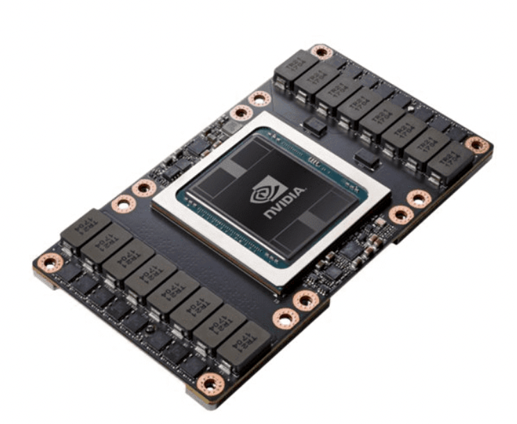
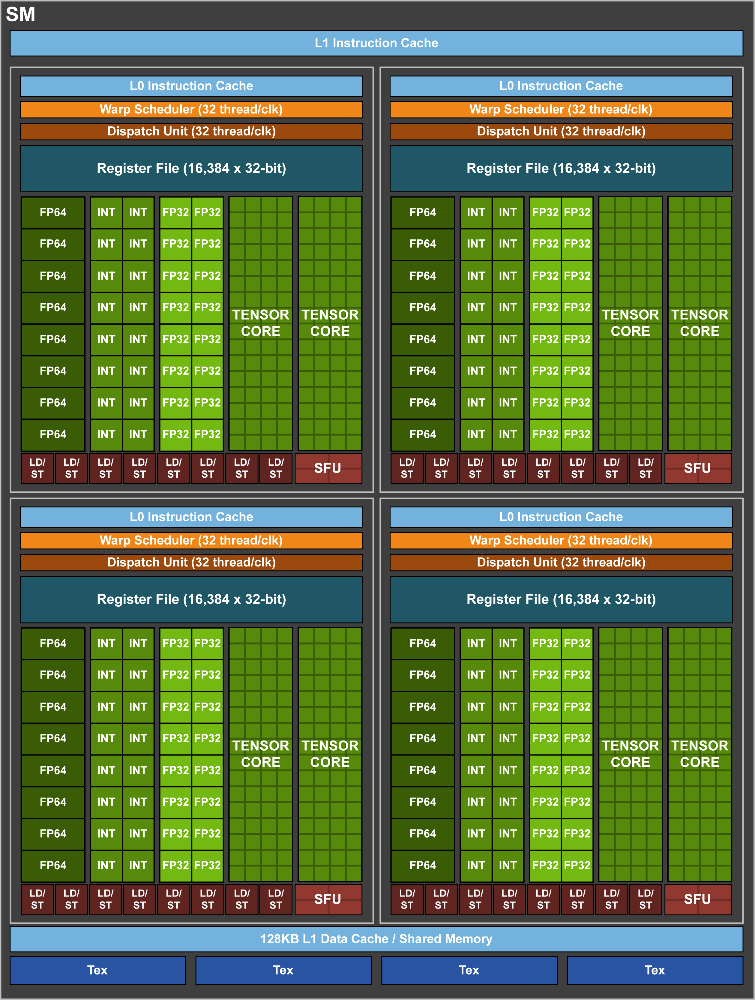
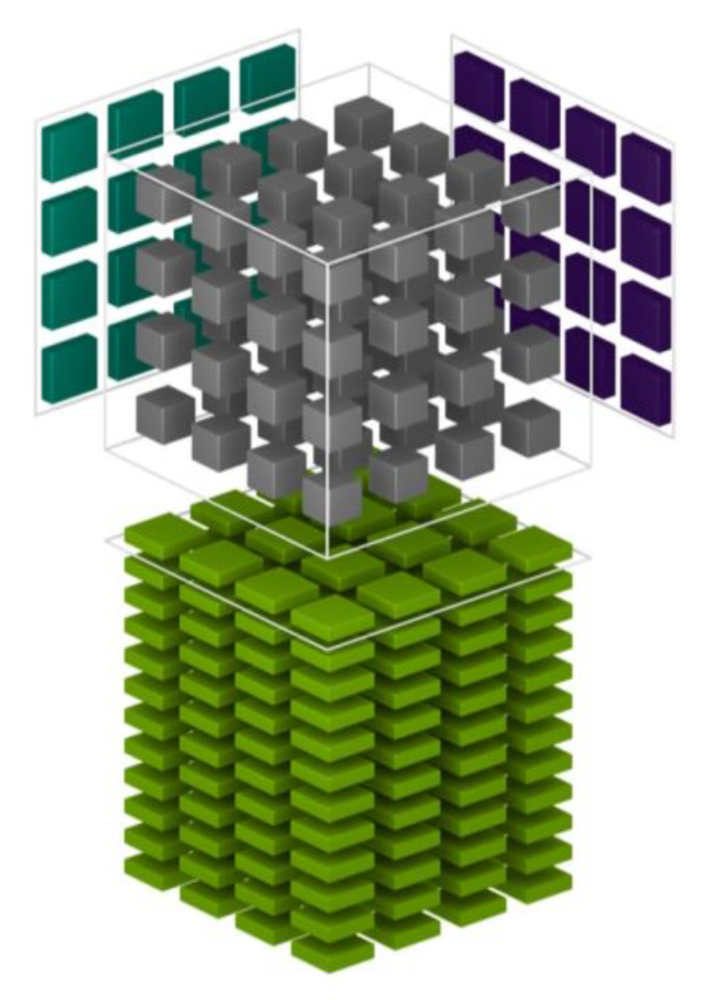

# GPU Example: Tesla V100

**原文：[Cornell University -> Cornell Virtual Workshop -> Understanding GPU Architecture -> GPU Example: Tesla V100](https://cvw.cac.cornell.edu/gpu-architecture/gpus-frontera-rtx-5000/index)**

It's fine to have a general understanding of what graphics processing units can be used for, and to know conceptually how they work. But at the actual hardware level, what does a particular GPU consist of, if one peeks "under the hood"? Sometimes the best way to learn about a certain type of device is to consider one or two concrete examples. First we'll take detailed look at the Tesla V100, one of the NVIDIA models that has been favored for HPC applications. In a subsequent topic, we do a similar deep dive into the [Quadro RTX 5000](rtx_5000.md), a GPU which is found in TACC's Frontera.

大致了解图形处理单元的用途，并从概念上了解它们的工作原理，这很好。但在实际硬件层面，如果深入了解，特定 GPU 由什么组成？有时，了解某种设备的最佳方法是考虑一两个具体示例。首先，我们将详细了解 Tesla V100，这是 NVIDIA 型号之一，在 HPC 应用方面备受青睐。在后续主题中，我们将对 [Quadro RTX 5000](rtx_5000.md) 进行类似的深入研究，这是 TACC Frontera 中的 GPU。

# NVIDIA Tesla V100

NVIDIA Tesla V100, in the SXM2 form factor.

Some scientific applications require 64-bit "double precision" for their floating point calculations. NVIDIA was one of the first GPU manufacturers to recognize this need and meet it in 2007 through its Tesla line of HPC components. Fourteen years later, the Tesla V100 and related Volta devices could be found in 20% of all supercomputers in the [Top500 list](https://top500.org/statistics/details/accelfam/11/).

一些科学应用程序需要 64 位“双精度”进行浮点计算。NVIDIA 是首批认识到这一需求的 GPU 制造商之一，并于 2007 年通过其 Tesla HPC 组件系列满足了这一需求。十四年后，Tesla V100 和相关的 Volta 设备出现在 [Top500 榜单](https://top500.org/statistics/details/accelfam/11/) 中 20% 的超级计算机中。

Among these systems was TACC's Frontera, which initially included a V100-equipped subsytem called "Longhorn" for supporting general-purpose GPU (GPGPU). Prior to its decommissioning in 2022, Longhorn comprised 100+ IBM nodes, each equipped with 4 NVIDIA Tesla V100s.

这些系统包括 TACC 的 Frontera，它最初包含一个配备 V100 的子系统，称为“Longhorn”，用于支持通用 GPU (GPGPU)。在 2022 年退役之前，Longhorn 包含 100 多个 IBM 节点，每个节点配备 4 个 NVIDIA Tesla V100。

The Tesla V100 is a good choice for GPGPU because it contains 2560 double precision CUDA cores, all of which can execute a fused multiply-add (FMA) on every cycle. This gives the V100 a peak double precision (FP64) floating-point performance of 7.8 teraflop/s, computed as follows:

Tesla V100 是 GPGPU 的不错选择，因为它包含 2560 个双精度 CUDA 核心，所有这些核心都可以在每个周期执行融合乘加 (FMA)。这使 V100 的峰值双精度 (FP64) 浮点性能达到 7.8 teraflop/s，计算如下：

$$
2560 \text{FP64 CUDA cores} \times 2 \frac{\text{flop}}{\text{core} \cdot \text{cycle}} \times 1.53 \frac{\text{Gcycle}}{\text{s}} \approx 7.8 \frac{\text{Tflop}}{\text{s}}
$$

The factor of 2 flop/core/cycle comes from the ability of each core to execute FMA instructions. The V100's peak rate for single precision (FP32) floating-point calculations is even higher, as it has twice as many FP32 CUDA cores as FP64. Therefore, its peak FP32 rate it is exactly double the above:

2 flop/core/cycle 这个倍数来自于每个核心执行 FMA 指令的能力。V100 的单精度（FP32）浮点计算峰值速率甚至更高，因为它的 FP32 CUDA 核心数量是 FP64 的两倍。因此，它的峰值 FP32 速率正好是上述的两倍：

$$
5120 \text{FP32 CUDA cores} \times 2 \frac{\text{flop}}{\text{core} \cdot \text{cycle}} \times 1.53 \frac{\text{Gcycle}}{\text{s}} \approx 15.7 \frac{\text{Tflop}}{\text{s}}
$$

It is interesting to compare the V100's peak FP64 rate to that of an Intel Xeon Platinum 8280 "Cascade Lake" processor on Frontera, assuming it runs at its maximum "Turbo Boost" frequency on all 28 cores, with 2 vector units per core core doing FMAs on every cycle:

将 V100 的峰值 FP64 速率与 Frontera 上的 Intel Xeon Platinum 8280 “Cascade Lake” 处理器的峰值进行比较很有趣，假设它在所有 28 个内核上都以最大“Turbo Boost”频率运行，每个内核有 2 个矢量单元在每个周期执行 FMA：

$$
56 \text{VPUs} \times 8 \frac{\text{FP64-lanes}}{\text{VPU}} \times 2 \frac{\text{flop}}{\text{lane} \cdot \text{cycle}} \times 2.4 \frac{\text{Gcycle}}{\text{s}} \approx 2.15 \frac{\text{Tflops}}{\text{s}}
$$

Clearly, the Tesla V100 has an advantage for highly parallel, flop-heavy calculations, even in double precision.

显然，Tesla V100 在高度并行、浮点运算密集型计算（甚至双精度计算）方面具有优势。

The Volta architecture, like all NVIDIA's GPU designs, is built around a scalable array of Streaming Multiprocessors (SMs) that are individually and collectively responsible for executing many threads. Each SM contains an assortment of CUDA cores for handling different types of data, including FP32 and FP64. The CUDA cores within an SM are responsible for processing the threads synchronously by executing arithmetic and other operations on warp-sized groups of the various datatypes.

与 NVIDIA 的所有 GPU 设计一样，Volta 架构是围绕可扩展的流式多处理器 (SM) 阵列构建的，这些 SM 单独和集体负责执行许多线程。每个 SM 包含各种 CUDA 核心，用于处理不同类型的数据，包括 FP32 和 FP64。SM 中的 CUDA 核心负责通过对各种数据类型的 warp 大小组执行算术和其他操作来同步处理线程。

Given the large number of CUDA cores, it is clear that to utilize the device fully, many thousands of SIMT threads need to be launched by an application. This implies that the application must be amenable to an extreme degree of fine-grained parallelism.

鉴于 CUDA 核心数量庞大，显然要充分利用该设备，应用程序需要启动数千个 SIMT 线程。这意味着应用程序必须能够适应极高的细粒度并行性。

# Volta Block Diagram

The NVIDIA Tesla V100 accelerator is built around the Volta GV100 GPU. This chip is designed to provide significant speedups to deep learning algorithms and frameworks, and to offer superior number-crunching power to HPC systems and applications.

NVIDIA Tesla V100 加速器基于 Volta GV100 GPU 构建。该芯片旨在显著提高深度学习算法和框架的速度，并为 HPC 系统和应用程序提供卓越的数字运算能力。

As with NVIDIA's previous Pascal generation, the Volta GV100 GPU consists of many Streaming Multiprocessors (SMs) arranged into a loose hierarchy. The SMs are paired into Texture Processing Clusters (TPCs), which are in turn grouped into GPU Processing Clusters (GPCs). The GV100's overall design is depicted in the figure. In the ideal case, the chip is comprised of 84 Volta SMs, which are partitioned into 6 GPCs.

与 NVIDIA 上一代 Pascal 一样，Volta GV100 GPU 由许多流式多处理器 (SM) 组成，这些多处理器排列成松散的层次结构。SM 配对成纹理处理集群 (TPC)，而纹理处理集群又分组成 GPU 处理集群 (GPC)。图中描绘了 GV100 的整体设计。在理想情况下，该芯片由 84 个 Volta SM 组成，这些 SM 被划分为 6 个 GPC。

Volta GV100 block diagram.

The higher-level organization into processing clusters is really only relevant to graphics applications. (But in case you were counting: in the _full_ GV100 GPU shown above, each of the 6 GPCs contains exactly 7 TPCs, for a total of 6 x 7 x 2 = 84 SMs. However, we know that the _actual_ GV100 GPU used in the Tesla V100 has only 80 SMs, implying that a couple of its GPCs must have 6 TPCs.)

更高级别的处理集群组织实际上仅与图形应用程序相关。（但如果您计算的话：在上面显示的 _full_ GV100 GPU 中，6 个 GPC 中的每一个都恰好包含 7 个 TPC，总共 6 x 7 x 2 = 84 个 SM。但是，我们知道 Tesla V100 中使用的 _实际_ GV100 GPU 只有 80 个 SM，这意味着它的几个 GPC 必须有 6 个 TPC。）

The edges of the block diagram show the links to other system components. The longest bar represents the PCIe 3.0 link to the host. The green blocks on the opposite edge are the much faster NVLink 2.0 bridges leading to other NVIDIA devices, as well as to certain POWER9-based hosts, including the IBM AC922 servers in Longhorn (now decommissioned). On the other edges are the eight 512-bit memory controllers (4096 bits total) that connect the entire array of SMs to the device's HBM2 high bandwidth memory. The role of the central L2 cache memory will be described later.

框图的边缘显示了与其他系统组件的链接。最长的条表示 PCIe 3.0 与主机的链接。对边的绿色块是速度更快的 NVLink 2.0 桥接器，可通向其他 NVIDIA 设备以及某些基于 POWER9 的主机，包括 Longhorn（现已退役）中的 IBM AC922 服务器。其他边缘是八个 512 位内存控制器（总共 4096 位），它们将整个 SM 阵列连接到设备的 HBM2 高带宽内存。中央 L2 高速缓存的作用将在后面描述。

# Inside a Volta SM

We now zoom in on one of the streaming multiprocessors depicted in the diagram on the previous page. Each Volta SM gets its processing power from:

现在我们放大上一页图表中描绘的流式多处理器之一。每个 Volta SM 的处理能力来自：

*   Sets of CUDA cores for the following datatypes
    *   64 FP32 CUDA cores
    *   64 INT32 CUDA cores
    *   32 FP64 CUDA cores
*   8 Tensor Cores
*   16 Special Function Units
*   4 Texture units

* 适用于以下数据类型的 CUDA 核心集
    * 64 个 FP32 CUDA 核心
    * 64 个 INT32 CUDA 核心
    * 32 个 FP64 CUDA 核心
* 8 个 Tensor 核心
* 16个特殊功能单元
* 4 个纹理单元

In general, an SM is subdivided into 4 processing blocks, as shown in the figure. This allows for greater flexibility in scheduling. The CUDA cores can be scheduled so that on every clock cycle, up to 2 warps of FP32 or INT32 can be processed (possibly 1 of each), or just 1 warp of FP64.

通常，SM 被细分为 4 个处理块，如图所示。这允许在调度方面具有更大的灵活性。可以调度 CUDA 核心，以便在每个时钟周期内，最多可以处理 2 个 FP32 或 INT32 的 warp（可能各 1 个），或者仅处理 1 个 FP64 的 warp。

NVIDIA Volta Streaming Multiprocessor (SM) block diagram.

Data are supplied to the main part of this hardware through 32 Load/Store units, as shown at the bottom of each processing block.

数据通过 32 个加载/存储单元提供给该硬件的主要部分，如每个处理块的底部所示。

# Tensor Cores

Matrix multiplications lie at the heart of Convolutional Neural Networks (CNNs). Both training and inferencing require the multiplication of a series of matrices that hold the input data and the optimized weights of the connections between the layers of the neural net. The Tesla V100 is NVIDIA's first product to include _tensor cores_ to perform such matrix multiplications very quickly. Assuming that half-precision (FP16) representations are adequate for the matrices being multiplied, CUDA 9.1 and later use Volta's tensor cores whenever possible to do the convolutions. Given that very large matrices may be involved, tensor cores can greatly improve the training and inference speed of CNNs.

矩阵乘法是卷积神经网络 (CNN) 的核心。训练和推理都需要对一系列矩阵进行乘法，这些矩阵保存输入数据和神经网络层之间连接的优化权重。Tesla V100 是 NVIDIA 首款包含“张量核心”的产品，可以非常快速地执行此类矩阵乘法。假设半精度 (FP16) 表示足以用于被乘以的矩阵，CUDA 9.1 及更高版本会尽可能使用 Volta 的张量核心进行卷积。考虑到可能涉及非常大的矩阵，张量核心可以大大提高 CNN 的训练和推理速度。

The Tesla V100 has 640 tensor cores in total: there are 8 in each of its 80 SMs, arranged so that one SM's 4 processing blocks hold 2 apiece. A single tensor core can perform 64 half-precision FMA operations per clock cycle, so that the 8 tensor cores in one GV100 SM can perform 512 FMAs (1024 individual floating point operations!) per clock cycle.

Tesla V100 总共有 640 个张量核心：80 个 SM 中每个都有 8 个张量核心，每个 SM 的 4 个处理块各有 2 个。单个张量核心每个时钟周期可以执行 64 次半精度 FMA 运算，因此一个 GV100 SM 中的 8 个张量核心每个时钟周期可以执行 512 次 FMA（1024 次单独的浮点运算！）。

The basic role of a tensor core is to perform the following operation on 4x4 matrices:

张量核的基本作用是对 4x4 矩阵执行以下操作：

$$
D = A \times B + C
$$

In this formula, the inputs A and B are FP16 matrices, while the input and accumulation matrices C and D may be FP16 or FP32 matrices (see the figure below).

在这个公式中，输入A和B是FP16矩阵，而输入和累积矩阵 C 和 D 可能是 FP16 或 FP32 矩阵（见下图）。

How an NVIDIA tensor core operates on 4x4 matrices.

NVIDIA has come up with a way to visualize the action of the tensor core in 3D, which is shown in the next figure. However, this illustration isn't easy to understand at a glance. Here is an attempt to describe in words what it aims to illustrate, namely, how the tensor core performs fully parallelized 4x4 matrix operations.

NVIDIA 想出了一种以 3D 形式可视化张量核心动作的方法，如下图所示。但是，这个图示乍一看并不容易理解。这里尝试用文字描述它想要说明的内容，即张量核心如何执行完全并行的 4x4 矩阵运算。

The two matrices to be multiplied, A and B, are depicted outside the central cube (note, matrix A on the left is transposed). The cube itself represents the 64 element-wise products required to generate the full 4x4 product matrix. Imagine all 64 blocks within the cube "lighting up" at once, as pairs of input elements are instantaneously multiplied together along horizontal layers, then instantaneously summed along vertical lines. As a result, a whole product matrix (A times B, transposed) drops down onto the top of the pile, where it is summed with matrix C (transposed), outlined in white. Upon summation it becomes the next output matrix D and is pushed down onto the stack of results. Prior output matrices are shown piling up below the cube, beneath the latest output matrix D (all transposed).

要相乘的两个矩阵 A 和 B 位于中央立方体的外部（注意，左侧的矩阵 A 是转置的）。立方体本身代表生成完整 4x4 乘积矩阵所需的 64 个元素乘积。想象一下，立方体内的所有 64 个块同时“亮起”，因为输入元素对沿水平层瞬间相乘，然后沿垂直线瞬间相加。结果，整个乘积矩阵（A 乘以 B，转置）落到堆的顶部，在那里它与矩阵 C（转置）相加，以白色轮廓表示。相加后，它成为下一个输出矩阵 D，并被推入结果堆栈。先前的输出矩阵显示堆积在立方体下方，位于最新输出矩阵 D（全部转置）下方。

3D illustration of the action of a tensor core.  
Source: NVIDIA's [Volta Architecture Whitepaper](https://images.nvidia.com/content/volta-architecture/pdf/volta-architecture-whitepaper.pdf)

The reality of how the tensor core works is undoubtedly much more complicated than the illustration suggests. Probably it involves a multi-stage FMA pipeline that progresses downward layer by layer. One then envisions successive C matrices dropping in from the top to accumulate the partial sums of the products at each layer.

张量核心的实际工作原理无疑比图示中显示的要复杂得多。它可能涉及一个逐层向下推进的多级 FMA 管道。然后可以设想连续的 C 矩阵从顶部进入，以累积每层乘积的部分和。

# V100 Memory & NVLink 2.0

The Tesla V100 features high-bandwidth HBM2 memory, which can be stacked on the same physical package as the GPU, thus permitting more GPUs and memory to be installed in servers. The V100s in TACC Longhorn have eight memory chips per HBM2 stack, and four stacks, yielding 32 GB of GPU memory in each device. This configuration provides 900 GB/sec of peak memory bandwidth across the four stacks.

Tesla V100 具有高带宽 HBM2 内存，可以与 GPU 堆叠在同一物理封装上，从而允许在服务器中安装更多 GPU 和内存。TACC Longhorn 中的 V100 每个 HBM2 堆栈有八个内存芯片，四个堆栈，每个设备有 32 GB 的 GPU 内存。此配置在四个堆栈上提供 900 GB/秒的峰值内存带宽。

Data integrity is important in scientific computing, and the CPUs of HPC systems typically have ECC (error correction code) memory as a guard against data corruption. This feature is found in NVIDIA's GPGPU devices as well, and it is a property of both the Tesla V100 and the Quadro RTX 5000.

数据完整性在科学计算中非常重要，HPC 系统的 CPU 通常具有 ECC（错误校正代码）内存，以防止数据损坏。NVIDIA 的 GPGPU 设备也具有此功能，它是 Tesla V100 和 Quadro RTX 5000 的一项特性。

Most often, data starts out on the host and must be transferred to the memory on the device. Such memory transfers may be initiated explicitly, but it is also possible to do this through Unified Memory, a single memory address space that permits applications to allocate and access a common set of data from code running on either CPUs or GPUs.

数据通常从主机开始，然后必须传输到设备上的内存中。此类内存传输可以明确启动，但也可以通过统一内存来完成。统一内存是一个单一的内存地址空间，允许应用程序从在 CPU 或 GPU 上运行的代码分配和访问一组通用数据。

Allocating Unified Memory is straightforward: typical calls to `malloc()` or `new` are simply replaced with calls to `cudaMallocManaged()`. The resulting pointer provides access to the data from any processor. CUDA system software works with the hardware to take care of migrating the requested memory pages to the physical memory of the accessing processor, whether it is on the host or the device.

分配统一内存非常简单：对 `malloc()` 或 `new` 的典型调用只需替换为对 `cudaMallocManaged()` 的调用即可。生成的指针提供对任何处理器的数据的访问。CUDA 系统软件与硬件协作，负责将请求的内存页面迁移到访问处理器的物理内存，无论是在主机还是设备上。

Several streams of memory transfers are typically initiated on the CPU side, so that some GPU kernels can start doing their computations while other kernels wait for data. This is true of explicit transfers as well as those done implicitly through Unified Memory.

通常在 CPU 端启动多个内存传输流，以便一些 GPU 内核可以开始进行计算，而其他内核则等待数据。显式传输和通过统一内存隐式完成的传输都是如此。

## Host-to-Device and Device-to-Device Transfers(主机到设备和设备到设备的传输)

The speed at which data can be transferred from the host to the device and back is set by the type of interconnect. In most cases, GPU devices are inserted into expansion slots in their hosts, and the number of PCIe lanes in the slot determines the peak bandwidth. Commonly, the Tesla V100 is connected to the host by 16 lanes (x16) of PCIe3, each capable of 1 GB/s in each direction, providing an overall bidirectional bandwidth of 32 GB/s.

数据从主机传输到设备并返回的速度由互连类型决定。在大多数情况下，GPU 设备插入主机的扩展槽中，插槽中的 PCIe 通道数量决定了峰值带宽。通常，Tesla V100 通过 16 个 PCIe3 通道 (x16) 连接到主机，每个通道每个方向的速率为 1 GB/s，提供 32 GB/s 的总双向带宽。

TACC Longhorn, however, was built around IBM POWER9 processors, which at the time were the only CPUs that could communicate directly with GPUs using NVIDIA's NVLink 2.0 technology. NVLink was originally developed to provide dramatic improvements in bandwidth between GPU devices, but in IBM servers it was further used to remove the potential PCIe bottleneck between CPUs and GPUs. The figure below shows the speeds of the bidirectional NVLink 2.0 connections within a Longhorn node.

然而，TACC Longhorn 是围绕 IBM POWER9 处理器构建的，当时，IBM POWER9 处理器是唯一能够使用 NVIDIA 的 NVLink 2.0 技术直接与 GPU 通信的 CPU。NVLink 最初是为了显著提高 GPU 设备之间的带宽而开发的，但在 IBM 服务器中，它进一步用于消除 CPU 和 GPU 之间潜在的 PCIe 瓶颈。下图显示了 Longhorn 节点内双向 NVLink 2.0 连接的速度。

IBM AC922 with 4 NVIDIA Tesla V100s  
Source: [IBM presentation at GTC 2018](https://on-demand.gputechconf.com/gtc/2018/presentation/s8309-nvidia-v100-performance-characteristics-on-ibm-power-9-system-and-hpc-application-performance.pdf)

If each POWER9 processor had just one V100 attached to it, that single connection could reach the full peak bidirectional bandwidth of 300 GB/s. As it is, the bandwidth to one of the processors is split between two attached GPUs to give 150 GB/s to each, and these GPUs are in turn attached to one another with a 150 GB/s link. The second processor in each node has a similar arrangement with 2 attached GPUs of its own.

如果每个 POWER9 处理器只连接一个 V100，那么该单一连接就可以达到 300 GB/s 的峰值双向带宽。实际上，其中一个处理器的带宽被分配给两个连接的 GPU，每个 GPU 提供 150 GB/s，而这些 GPU 又通过 150 GB/s 的链路相互连接。每个节点中的第二个处理器也有类似的安排，有 2 个自己的连接 GPU。

The L2 cache plays a key role in moving data from the host to the device's global memory, as well as from global memory to the SMs and CUDA cores. The full memory hierarchy and the properties of the various caches within it were [detailed in the GPU Memory topic](gpu_memory.md).

L2 缓存在将数据从主机移动到设备的全局内存以及从全局内存移动到 SM 和 CUDA 核心方面发挥着关键作用。完整的内存层次结构及其内部各种缓存的属性[在 GPU 内存主题中详细介绍](gpu_memory.md)。

In conclusion, the high flop rate of a GPU is only meaningful if the data rate from and to the host can keep up. NVLink 2.0 and HBM2 may therefore be crucial in allowing data-heavy applications to use the full speed of the V100. In any case, it is a viable option for applications that need FP64 precision.

总之，只有主机的数据速率能够跟上，GPU 的高翻转率才有意义。因此，NVLink 2.0 和 HBM2 可能对于允许数据密集型应用程序充分利用 V100 的速度至关重要。无论如何，对于需要 FP64 精度的应用程序来说，这是一个可行的选择。