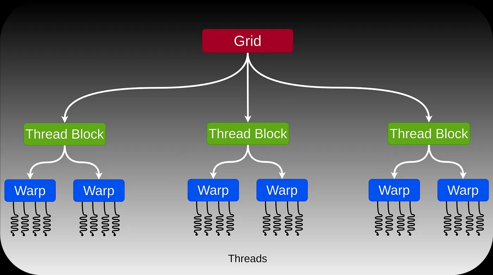
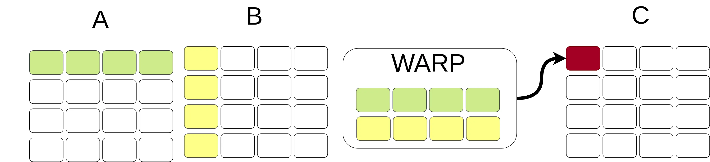
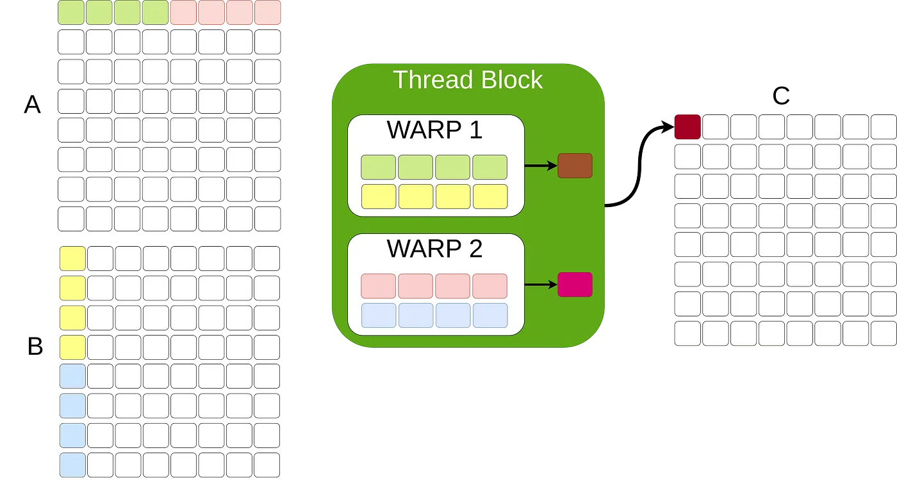
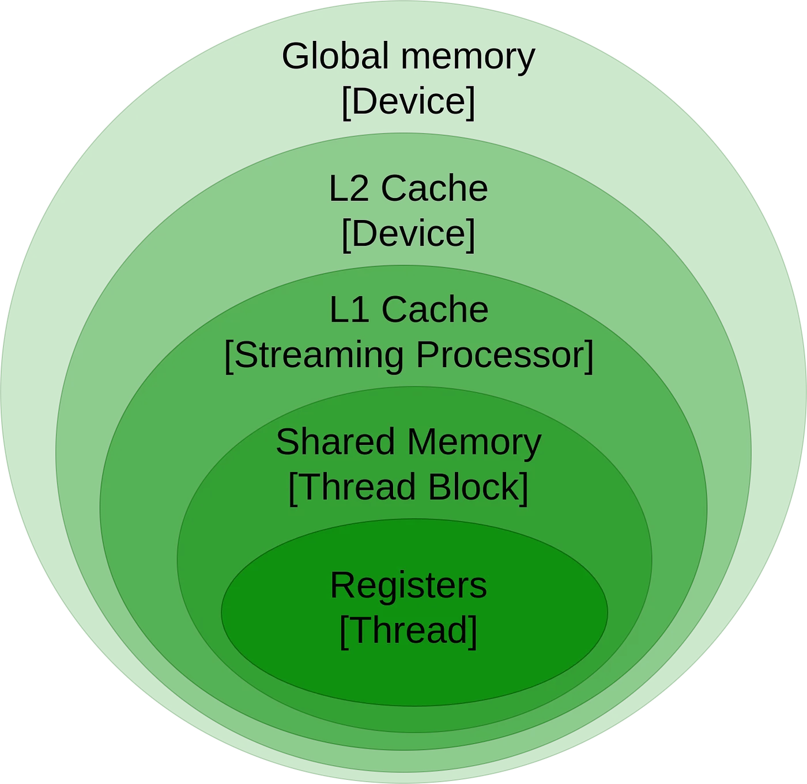

# GPU Architecture and Programming — An Introduction

作者：Najeeb Khan，[原文链接](https://medium.com/@najeebkan/gpu-architecture-and-programming-an-introduction-561bfcb51f54)

Explore Kernel Grids, Blocks, Warps, and Threads to Accelerate Your Code



A GPU executes code in a hierarchical fashion with the kernel as an independent unit of compute. The kernel is executed using independent thread blocks and each thread block consist of subgroups that work in lockstep called warps or wavefronts.

A general purpose graphics processing unit (GPU) provide parallel cores designed to process data simultaneously. Similar to the single instruction multiple data (SIMD) in CPUs, GPUs use several threads to execute instructions in parallel, the paradigm is known as single-instruction multiple threads (SIMT). Modern GPUs can theoretically run one instruction across thousands of data points in a single cycle. However, practical applications often require data exchange between operations, which can consume hundreds of clock cycles. To address this, GPUs use a hierarchical structure to manage communication latency.

# Architecture

In this section, we explore the architecture of a typical GPU. While each GPU generation introduces unique optimizations, we focus on the core concepts that are common across most GPUs.

## Warps

At the core level, each **_thread_** operates on individual scalar values with private registers. While running thousands of threads simultaneously is impractical, individual threads are not efficient on their own either. Instead, threads are organized into small groups called **_warps or wavefronts_**, typically consisting of 32 threads. Each warp executes a single instruction across 32 data points. For example, in matrix multiplication, a warp might process a row and column from two matrices, performing multiplication and accumulation to generate results as shown in the figure below.



A four thread warp performing matrix multiplication. The warp first performs independent point-wise multiply operation and then performs accumulate operation using some shared memory.

## Thread Blocks

When operations exceed the warp size of 32 threads, GPUs use tiling to manage larger dimensions. This involves dividing the input into chunks or tiles that fit the warp size, processing these chunks, and then combining the results from all warps. To accumulate partial results, a placeholder is needed, which is where **_thread blocks_** come in. A thread block groups multiple warps, allowing them to share memory and synchronize their execution, as illustrated in the figure below.



A thread block comprising of two warps computing matrix multiplication. All the warps in a thread block need to complete execution in order to compute the final output.

## Grid

The hierarchy from warps to blocks is repeated one more level: if the matrix is larger than what a single thread block can handle, we use a **_grid_** of thread blocks that share global memory. The grid enables the GPU to process large datasets by distributing the workload across multiple thread blocks.

All GPU programs, known as **_kernels_**, are executed within this grid structure. When you launch a kernel, you specify both the grid size (the number of thread blocks) and the block size (the number of threads per block). This hierarchical approach ensures efficient computation and data management, allowing the GPU to handle extensive and complex tasks effectively.

## Memory Hierarchy

Following the structure of the computations, memory is organized into a hierarchy starting from the small and fast registers with ultra low latency and a few kilobytes in size. Registers are private to threads. Next, warps within a thread block share state using **_shared memory_** comprising several hundred kilobytes. Finally, global memory is accessible across the device and provides large capacity on the order of tens of gigabytes with high throughput approaching a terabyte per second. Global memory has higher latency and thus caching is used to reduce latency. The figure below shows the relative scope of each memory type.




# Programming

Programming GPUs are supported by dedicated software libraries in C/C++ depending on the make of the GPU: NVIDIA GPUs can be programmed using Compute Unified Device Architecture (CUDA) interface whereas AMD GPUs offer a similar SDK known as HIP.

In this section we will briefly show how to run a hello world program on multiple threads using CUDA and how to multiply two matrices.

## Hello World!

The entry point of a GPU program is called a kernel. The global ID of a thread can be calculated using three compiler intrinsics — _blockIdx, blockDim, and threadIdx,_ representing the id of the block, the total number of threads in a block, and the thread id within the thread block, respectively. A kernel is defined by the _\_\_global\_\__ qualifier as shown in the listing below. To launch a kernel the _<<<numBlocks, blockSize>>>_ is used. The kernel is executed asynchronously, i.e., the host code will continue to run right after making the kernel call. To sync memory between the host and the GPU device the _cudaDeviceSynchronize_ function is called, which blocks the execution on the host until the kernel finishes its work.

```cpp
#include <cuda_runtime.h>  
#include <iostream>  
  
__global__ void helloFromGPU() {  
    printf("Hello World from Thread %d, Block %d, BlockDim %d\\n",   
            threadIdx.x, blockIdx.x, blockDim.x);  
}  
  
int main() {  
    // Launch the kernel with 2 blocks of 4 threads each  
    helloFromGPU<<<2, 4>>>();  
    cudaDeviceSynchronize();  // Wait for the GPU to finish  
    return 0;  
}
```

The above code can be compiled using the NVIDIA compiler and run as follows:

```bash

> nvcc hello_gpu.cu -o hello_gpu  
> ./hello_gpu  
Hello World from Thread 0, Block 0, BlockDim 4  
Hello World from Thread 1, Block 0, BlockDim 4  
Hello World from Thread 2, Block 0, BlockDim 4  
Hello World from Thread 3, Block 0, BlockDim 4  
Hello World from Thread 0, Block 1, BlockDim 4  
Hello World from Thread 1, Block 1, BlockDim 4  
Hello World from Thread 2, Block 1, BlockDim 4  
Hello World from Thread 3, Block 1, BlockDim 4
```

## Matrix Multiplication

Now that we know the basic structure of a CUDA program, let’s look at a more involved example of matrix multiplication. The CUDA kernel for matrix multiplication is given in the listing below. CUDA provides block IDs and thread IDs in three dimensions. In our case, since we’re dealing with matrices, we use only two dimensions: x and y for the row and column indices.

The kernel calculates the global row and column indices of each thread by combining the block index and thread index. Each thread then performs the dot product of the corresponding row from matrix A and the column from matrix B, storing the result in matrix C. This approach ensures that each element of the output matrix is computed in parallel, leveraging the GPU’s ability to handle many threads simultaneously.

```cpp
__global__ void matrixMul(const float* A, const float* B, float* C, int n) {  
    int row = blockIdx.y * blockDim.y + threadIdx.y;  
    int col = blockIdx.x * blockDim.x + threadIdx.x;  
  
    if (row < n && col < n) {  
        float value = 0.0f;  
        for (int k = 0; k < n; ++k) {  
            value += A[row * n + k] * B[k * n + col];  
        }  
        C[row * n + col] = value;  
    }  
}
```

While this example provides a straightforward implementation of matrix multiplication, it is not optimized for performance. In real-world applications, achieving efficient computation requires careful consideration of memory access patterns and cache utilization. Techniques such as tiling and shared memory usage can significantly enhance performance by reducing memory access latency and improving data locality. Proper cache planning and optimization strategies are essential for scaling these algorithms to handle larger datasets and more complex computations efficiently.