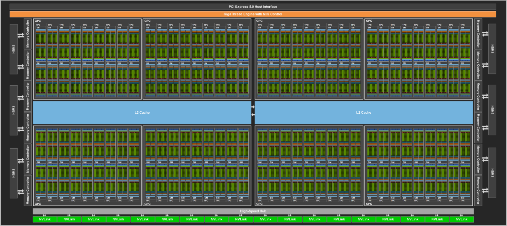
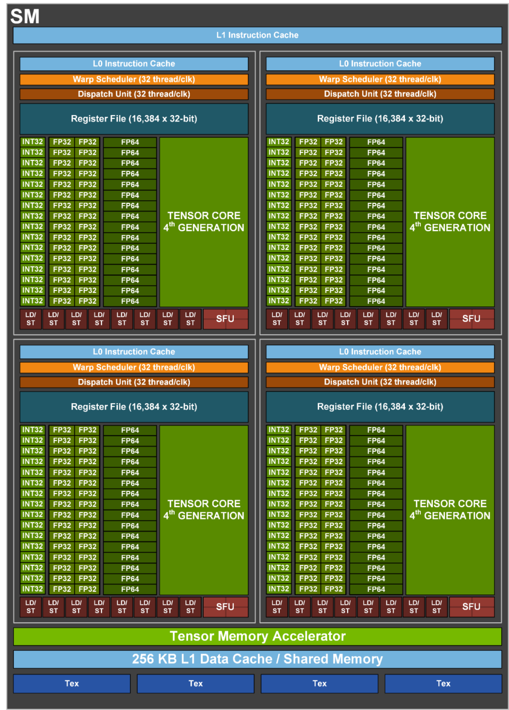
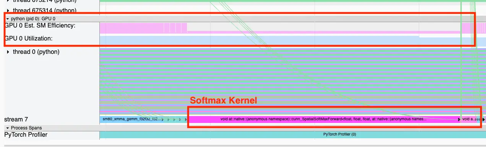
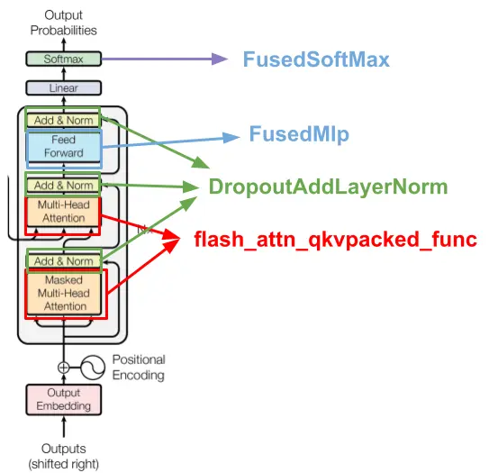

# GPU Utilization is a Misleading Metric

**The most common metric ML teams use to understand GPU usage is GPU Utilization, commonly accessed by running nvidia-smi from your terminal. Many integrated observability tools track GPU Utilization as their main performance metric as well.** Somewhat to our surprise, it turns out that this is not always the best metric for understanding your GPU performance. In fact, you can get 100% GPU utilization by just reading/writing to memory while doing 0 computations! This article is about how we found that out, and what else we learned along the way.

At [Trainy](https://trainy.ai/), we work on infrastructure for managing GPU clusters, so we spend a lot of time thinking about this stuff. Last year we were working with a foundation model company to scale out and improve the efficiency of their LLM training. We went through the basic steps that are mentioned in practically every guide about performance tuning for Pytorch—namely:

*   Saturate the GPU by changing dataloader defaults (num\_workers, batch\_size, pin\_memory, prefetch factor, etc.)
*   Maximize tensor core usage by using mixed precision (fp16, bf16)
*   Use a fused optimizer from apex/deepspeed (e.g. FusedAdam, FusedAdamW, etc.)
*   Use instances/networking designed for training (H100SXM, A100SXM). Also, use newer instances when possible H100 > A100 > V100

These simple changes got us to 100% GPU utilization and significant power draw, which is great! To check whether more could be done, we calculated the MFUs of the training workload.

> A quick refresher: MFUs, or Model FLOPS (Floating point Operations Per Second) utilization, is one of the best metrics to understand GPU performance, as introduced in [Google’s PaLM paper](https://arxiv.org/pdf/2204.02311). It is "the ratio of the observed throughput (tokens-per-second) relative to the theoretical maximum throughput of a system operating at peak FLOPs.” In simpler terms, it tells you how many floating point operations per second your workload computes compared to your GPU’s maximum capabilities. Its only real drawback is that MFU can be somewhat difficult to calculate compared to a metric like GPU utilization, since it is parameter and framework-dependent.

Unfortunately, the model training was only hitting ~20% MFUs. For reference, most LLM trainings today hit around [35% - 45% MFUs](https://github.com/mosaicml/llm-foundry/tree/main/scripts/train/benchmarking). So the question became: How could we only be using 20% of the theoretical max of our GPU’s computational power, while also sitting at 100% GPU utilization?

To answer this, we need a better understanding of what GPU utilization is actually tracking.

## What is GPU Utilization, really?

GPU utilization is loosely defined on [the Nvidia docs](https://developer.nvidia.com/management-library-nvml) as "Current utilization rates are reported for both the compute resources of the GPU and the memory interface.” This is wonderfully vague.

A better definition can (surprisingly) be found on [Datadog’s NVML docs](https://docs.datadoghq.com/integrations/nvml/#metrics), "Percent of time over the past sample period during which one or more kernels was executing on the GPU.” To determine why this is misleading, we need a quick primer on how GPUs work.

A GPU has [cores and multiprocessing managers](https://cvw.cac.cornell.edu/gpu-architecture/gpu-characteristics/kernel_sm). With Nvidia GPUs these multiprocessing managers are referred to as streaming multiprocessors (SMs), and on AMD hardware these are referred to as compute units (CU). Below is an illustration of the GH100 GPU, with 144 SMs.

These multiprocessing managers can be thought of as foremen for a group of workers, in this case, cores. When you launch a CUDA kernel, the work is executed on CUDA cores by one or more SMs. As you can see below, a single SM on the GH100 chip has many CUDA cores.

**This means the metric, GPU Utilization, is only measuring whether a kernel is executing at a given time.** It has no indication of whether your kernel is using all cores available, or parallelizing the workload to the GPU’s maximum capability. In the most extreme case, you can get 100% GPU utilization by just reading/writing to memory while doing 0 FLOPS.

Now we’d like to clarify: this is only misleading to someone without a background in systems (like many ML engineers). As mentioned [here](https://arthurchiao.art/blog/understanding-gpu-performance/#24-the-use-methodology), the definition of GPU utilization does make some sense under the ["USE” methodology](https://www.brendangregg.com/usemethod.html).

But back to the problem at hand, this definition certainly explains the gap in GPU utilization % vs MFU % that we were seeing! There was certainly more performance left on the table, we just had to find it.

## Digging Deeper

The next step to search for more performance was certainly to profile the model’s training loop. We took a look at the training loop in Pytorch Profiler to get a better idea.

As you can see below, the Softmax kernel was registering high GPU utilization, but low for a metric called SM efficiency. Now this was already sounding the alarm for us because naive softmax is a notorious bottleneck for LLMs, with many [kernel fusions](https://triton-lang.org/main/getting-started/tutorials/02-fused-softmax.html#motivations) such as [FlashAttention](https://github.com/Dao-AILab/flash-attention) coming out to address its memory-bound nature. Given this information, the SM efficiency statistic could be pointing out inefficiencies in our model’s execution.

## But What does SM Efficiency represent?

SM efficiency (also known as SM activity) is a metric on Nvidia GPUs describing what % of SMs are active in a given time interval. As we previously mentioned, SMs can be thought of as foremen for a group of CUDA cores. An [Nvidia H100 GPU](https://developer.nvidia.com/blog/nvidia-hopper-architecture-in-depth/), for example, has 132 SMs, with 128 cores per SM, giving us a total of 16,896 cores. By measuring SM efficiency, we can determine whether our CUDA kernels are using our streaming multiprocessors. If we have a CUDA kernel that continuously runs for 10 seconds but only uses 1 SM, on an H100, this would register 100% utilization, but the SM efficiency would be 1 / 132 = 0.7%.

Great, this is exactly what we were looking for! We can monitor SM efficiency layer by layer to determine what the low-hanging fruits are in terms of potential gain from optimization.

## Making Optimizations

Now that we can easily identify which kernels aren’t running hot on the GPU, we can work on optimizing these layers. Since this is a transformer stack, most gains are going to be made by fusing the layers in the transformer block definition. The figure below summarizes what we optimized.

By fusing, we mean instead of using a PyTorch native definition of a set of layers, we replace it with a GPU kernel, implemented in either CUDA or Triton, that combines all the layers into one kernel. The speedup results from less time per kernel reading/writing to GPU memory than time spent doing math in the case of certain layers (e.g. [Softmax](https://triton-lang.org/main/getting-started/tutorials/02-fused-softmax.html)). [Flash Attention](https://github.com/Dao-AILab/flash-attention) is an example of such a fused kernel. The other kernels that needed to be fused are the [MLP](https://github.com/Dao-AILab/flash-attention/blob/9a11f440d3a34f618b4ba814c825b109c6d7e8f5/flash_attn/ops/fused_dense.py#L531) and [dropout layer norm residual add](https://github.com/Dao-AILab/flash-attention/blob/9a11f440d3a34f618b4ba814c825b109c6d7e8f5/flash_attn/ops/fused_dense.py#L531) operations.

Did we write these kernels ourselves? Nope. Most of these are already implemented in libraries like Flash Attention have implementations of layers as `nn.Modules` so that you don’t have to worry about implementing a `torch.autograd.function` from scratch using the kernels. In addition, these implementations are often already hardware optimized so they use less memory in addition to just being faster.

The biggest challenge is identifying where in your code you need to swap the appropriate layers. While `torch.compile` attempts to do this automagically, as of the time of writing this post, `torch.compile` [doesn’t play nicely with newer distributed strategies like FSDP](https://dev-discuss.pytorch.org/t/torch-compile-fsdp-dec-8th/1718) and doesn’t provide a lot of promised speedups in practice due to graph breaks. Hopefully, in the future, torch compilers can just do this for us, but for now, we are stuck manually adding fused implementations.

For results, we achieved a 4x speedup in training time and 38% MFU for this customer, from the original MFU of 20%. Most of the optimizations we made came from these fused kernels, as well as finding the right “level” of model parallelism given their model size and the 3.2 Tbps Infiniband that was available.

## Conclusion

We’d highly recommend most AI teams to track SM Efficiency on their GPU cluster as well as GPU Utilization. It gives a much more representative picture of how much performance you’re squeezing out of your GPUs, while GPU utilization can be a measure of whether or not the machine is idle. Of course, calculating MFUs would be great as well, but it isn’t really a metric you can monitor all the time and layer-by-layer. Meanwhile, [Nvidia DCGM](https://docs.nvidia.com/datacenter/dcgm/latest/user-guide/feature-overview.html#profiling-metrics) (Data Center GPU Manager) ships SM activity by default.

There are also more fine-grained metrics, such as SM occupancy (or Achieved Occupancy in Pytorch Profiler), that tell us how much work is being done by each SM. However, understanding these metrics is less straightforward than trying to get SM Efficiency as high as possible. If you’re interested in learning more, I’d recommend taking a look at the [Pytorch Profiler blog](https://pytorch.org/blog/pytorch-profiler-1.9-released/#gpu-metric-on-timeline), [DCGM docs](https://docs.nvidia.com/datacenter/dcgm/latest/user-guide/feature-overview.html#profiling-metrics), [Nsight’s kernel profiling guide](https://docs.nvidia.com/nsight-compute/ProfilingGuide/index.html), and [Nsight docs](https://docs.nvidia.com/gameworks/content/developertools/desktop/analysis/report/cudaexperiments/kernellevel/achievedoccupancy.htm).