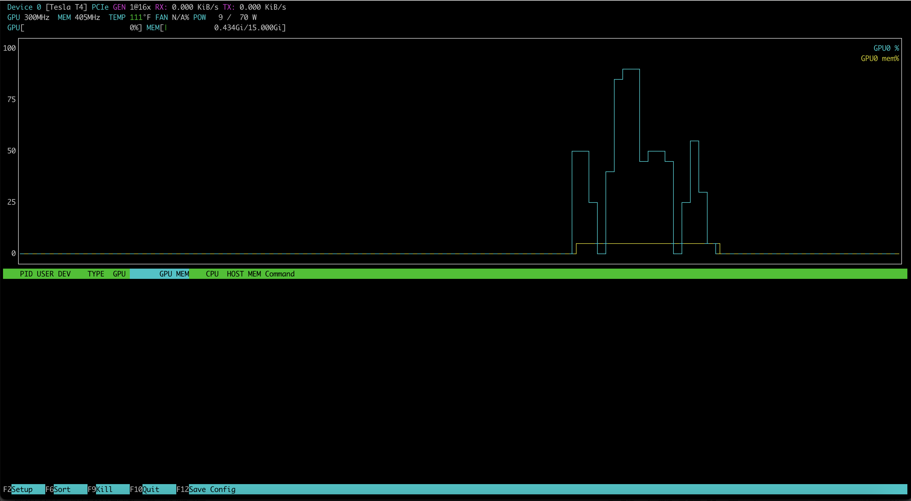
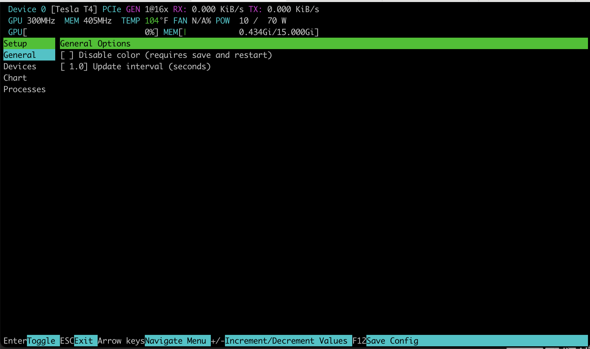

# nvtop 快速入门

## 1. 什么是 nvtop

nvtop 是一款类似于 `htop` 的命令行工具，可用于监控 NVIDIA、AMD、Intel 等多种 GPU。它提供了一个直观的界面，可以实时查看和管理 GPU 状态和进程信息。nvtop 支持多 GPU 监控，并且能够显示详细的指标，例如内存使用情况、GPU 利用率、温度等。

本文以 Nvidia T4 GPU 为例进行说明。

项目地址：[Github 地址](https://github.com/Syllo/nvtop)。

## 2. 如何安装 nvtop

### 2.1 在不同操作系统上的安装方法
具体参考项目 [README](https://github.com/Syllo/nvtop/blob/master/README.markdown)。

- **Ubuntu 19.04 / Debian Buster (stable)**:

  ```bash
  sudo apt install nvtop
  ```

- **旧版本系统（如 Ubuntu 16.04）**: 首先安装依赖库，然后编译源码安装：
  
  ```bash
   git clone https://github.com/Syllo/nvtop.git
   mkdir -p nvtop/build && cd nvtop/build
   cmake .. -DNVIDIA_SUPPORT=ON -DAMDGPU_SUPPORT=ON -DINTEL_SUPPORT=ON
   make

   # Install globally on the system
   sudo make install

   # Alternatively, install without privileges at a location of your choosing
   # make DESTDIR="/your/install/path" install
  ```

- **Arch Linux**:

  ```bash
  sudo pacman -Syu nvtop
  ```

- **Gentoo Linux**:
  
  ```bash
  sudo layman -a guru
  sudo emerge -av nvtop
  ```

- **Fedora 39 及更高版本**:
  
  ```bash
  sudo dnf install nvtop
  ```

- **CentOS Stream、Rocky Linux 和 AlmaLinux**:
  
  ```bash
  sudo dnf install -y epel-release
  sudo dnf install nvtop
  ```

- **其他 Linux 发行版**: 可以通过 Snap 安装：
  
  ```bash
  snap search nvtop
  sudo snap install nvtop
  ```

### 2.2 容器化安装

对于需要在容器中使用 nvtop 的情况，可以使用以下命令：

```bash
git clone https://github.com/Syllo/nvtop.git
cd nvtop
sudo docker build --tag nvtop .
sudo docker run -it --rm --runtime=nvidia --gpus=all --pid=host nvtop
```

## 3. 常用使用方式

安装完成后，运行 `nvtop` 即可启动监控界面。

### 3.1 nvtop

```bash
nvtop
```


常用的 `nvtop` 命令行选项如下：

- `-d --delay`: 设置刷新间隔，1 表示 0.1 秒。
- `-v --version`: 打印版本信息并退出。
- `-s --gpu-select`: 监控指定 GPU，多个 GPU ID 以冒号分隔。
- `-i --gpu-ignore`: 忽略指定 GPU，多个 GPU ID 以冒号分隔。
- `-p --no-plot`: 禁用条形图显示。
- `-C --no-color`: 禁用颜色显示。
- `-N --no-cache`: 始终从系统中查询用户名和命令行信息。
- `-f --freedom-unit`: 使用华氏度显示温度。
- `-E --encode-hide`: 设置编码/解码信息自动隐藏的时间（默认 30 秒，负值表示始终显示）。
- `-h --help`: 显示帮助信息并退出。

`nvtop` 界面快捷键：

| **快捷键**         | **描述**                                                                                       |
|--------------------|-------------------------------------------------------------------------------------------------|
| **上箭头**         | 选择（高亮）上一个进程。                                                                        |
| **下箭头**         | 选择（高亮）下一个进程。                                                                        |
| **左/右箭头**      | 在进程行中左右滚动。                                                                            |
| **+**              | 按升序排序。                                                                                     |
| **-**              | 按降序排序。                                                                                     |
| **F2**             | 进入设置界面，修改界面选项。                                                                     |
| **F12**            | 将当前界面选项保存到持久存储中。                                                                 |
| **F9**             | "终止"进程：选择要发送给高亮进程的信号。                                                        |
| **F6**             | 排序：选择用于排序的字段。当前排序字段在标题栏内高亮显示。                                       |
| **F10, q, Esc**    | 退出 nvtop 命令。                                                                                |


### 3.1 设置
点击 `F2` 可以打开设置页面：



可以通过上下左右键来选择并调整配置项。按 F12 保存在设置窗口中设置的首选项。下次运行 nvtop 时将加载这些首选项。

## 4. 总结

nvtop 是一款功能强大的 GPU 监控工具，它不仅展示了丰富的 GPU 运行状态，还支持高效的监控方式和互动操作。不论是在个人开发环境中，还是在大型数据中心的运维场景中，nvtop 都能发挥重要作用。通过简单的命令行操作，用户可以轻松监控和管理 GPU 资源，从而优化任务分配并提升系统性能。
