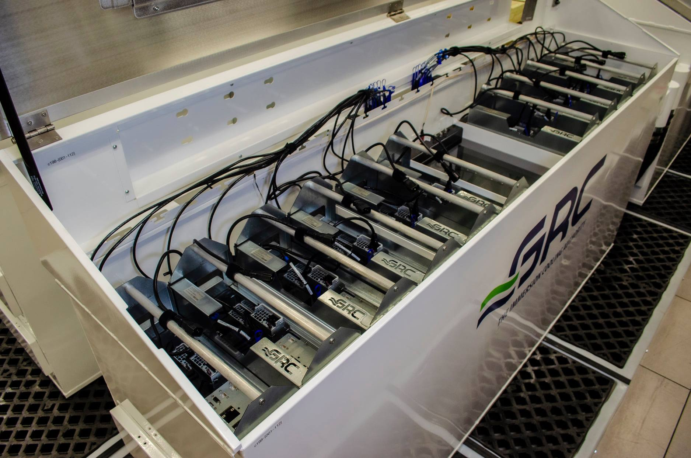
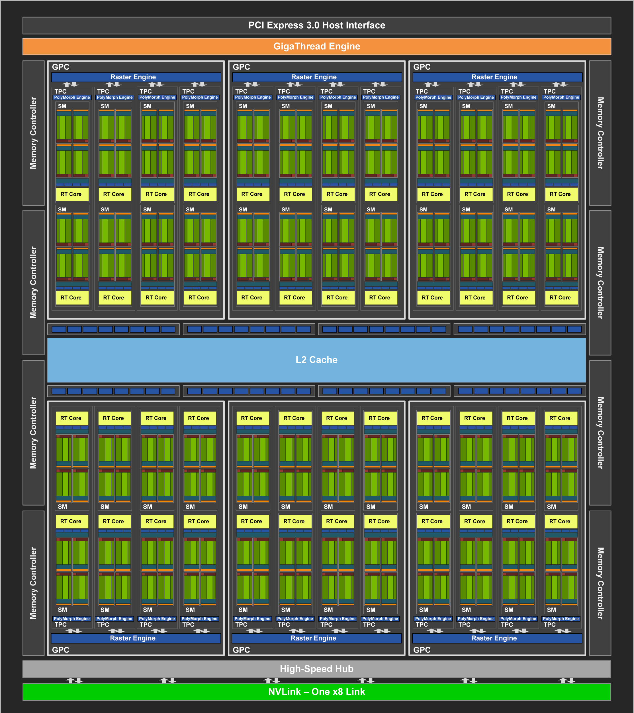
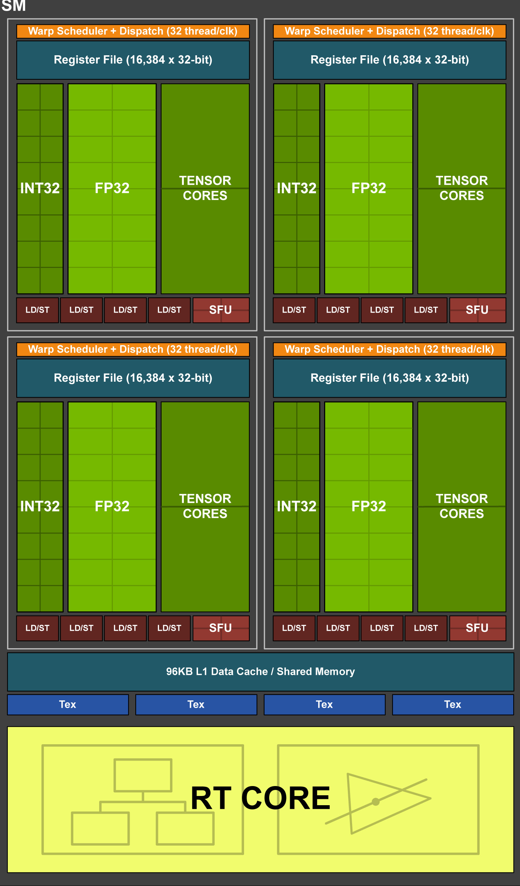

# GPU Example: RTX 5000

It's fine to have a general understanding of what graphics processing units can be used for, and to know conceptually how they work. But at the actual hardware level, what does a particular GPU consist of, if one peeks "under the hood"? Sometimes the best way to learn about a certain type of device is to consider one or two concrete examples. Here we'll be taking a detailed look at the Quadro RTX 5000, a GPU which is found in TACC's Frontera. In a previous topic, we did a similar deep dive into the [Tesla V100](tesla_v100.md), one of the NVIDIA models that has been favored for HPC applications.

# Frontera's GPU Subsystems

Tesla V100 servers in the former Longhorn subsystem of Frontera.

At inception, the leadership-class Frontera system at the Texas Advanced Computing Center included two GPU subsystems. The one shown in the top figure, called "Longhorn", was suitable for double-precision work. Prior to its decommissioning in 2022, it had over 400 NVIDIA Tesla V100 GPU accelerators hosted in 100+ IBM POWER9-based AC922 servers, with 4 GPUs per server. A full account of the properties of the Tesla V100 is found in a [prior topic](tesla_v100.md) of the Understanding GPU Architecture. The remaining subsystem, which can be accessed via special queues on Frontera, consists of 360 NVIDIA Quadro RTX 5000 graphics cards hosted in Dell/Intel Broadwell-based servers, again featuring 4 GPUs per server. Frontera's original pair of GPU subsystems combined to contribute 11 petaflop/s of single precision computing power to Frontera, serving to accelerate artificial intelligence, machine learning, and molecular dynamics research.

Quadro RTX 5000 servers at TACC with liquid cooling by GRC.

Interestingly, due to the very high concentrations of heat-generating computing power, Frontera's design includes special features to cool its components so they can run at top speed. Nearly all its racks and servers are water cooled, since standard air cooling with fans would be insufficient. The NVIDIA Quadros in particular are cooled in a very unusual way: as shown in the second figure, they are completely submerged in baths of liquid coolant, a solution developed by GRC. (The V100s in the former Longhorn subsystem happened to be air-cooled. However, if Longhorn had possessed 6 V100s per node instead of 4, then the water-cooled variant of the IBM AC922 servers would have been required.)

In the pages to come, we'll be taking a deep dive into the RTX 5000, to see what makes it attractive for doing GPGPU.

# NVIDIA Quadro RTX 5000

TACC's Frontera also offers a subsystem equipped with NVIDIA Quadro RTX 5000 graphics cards. These devices are based on NVIDIA's Turing microarchitecture, which is the next generation after Volta. Even so, for HPC purposes, the Quadros are individually less capable than the Tesla V100s in Frontera's former Longhorn subsystem.

If one looks in detail at the TU104 chip that lies at the heart of a Quadro RTX 5000, one sees that its Streaming Multiprocessors (SMs) are missing the CUDA cores for processing FP64 data. And even though a single Turing SM has the exact same number of FP32 and INT32 CUDA cores as a single Volta SM (64 for each datatype), the Quadro RTX 5000 has far fewer SMs overall: just 48 in total, as compared to the 80 SMs in the Tesla V100.

Accordingly, the peak FP32 performance of the Quadro is significantly below the 15.7 teraflop/s of the Tesla V100, despite the Quadro's faster Boost Clock:

$$
3072 \text{ CUDA cores} \times 2 \frac{\text{flop}}{\text{core/cycle}} \times 1.815 \frac{\text{Gcycle}}{\text{s}} \approx 11.2 \frac{\text{Tflop}}{\text{s}}
$$

The extra factor of 2 is included to account for the possibility of a fused multiply-add (FMA) on every cycle.

NVIDIA Quadro RTX 5000.

The TU104 also has a way to perform FMAs on FP64 data, but since it lacks dedicated CUDA cores for the purpose, it can only do so at the drastically reduced rate of 2 results/cycle/SM. You may refer to NVIDIA's [CUDA Programming Guide](https://docs.nvidia.com/cuda/cuda-c-programming-guide/index.html#arithmetic-instructions) for a full rundown of the throughput for different arithmetic instructions, based on the the compute capability of the device. (The TU104 has a compute capability of 7.5: footnote 5 of Table 3 is where to find the FMA rate for GPUs of that rating.)

The above calculation of FP32 peak performance does not mean that the Quadro RTX 5000 is inferior to the Tesla V100; it just means that the Quadro was primarily designed as a high-end graphics card. One could consider other kinds of metrics, too, such as flop/s/watt and cost/(flop/s), which might make the RTX 5000 an attractive component of HPC systems.

# Turing Block Diagram

Superficially, the block diagram of the Turing TU104 chip (below) has a hierarchy very similar to that of the GV100. The 48 SMs are paired up into 24 Texture Processing Clusters, which are divided into 6 GPU Processing Clusters.

Turing TU104 block diagram.

But the TU104 features a number of elements that are not found at all in a GV100, because each cluster or level in the hierarchy is home to a special type of processing unit that accomplishes a certain step in the graphics pipeline. The table below shows the special units that are associated with different blocks in the TU104 block diagram:

The association between the blocks (or cluster levels) in the block diagram and the special units found in an RTX 5000.

| **Block Name** | **Associated Special Unit** | **Count in TU104** |
|----------------|-----------------------------|--------------------|
| **SM**         | Ray Tracing Core            | 48                 |
| **TPC**        | PolyMorph Engine            | 24                 |
| **GPC**        | Raster Engine               | 6                  |

In addition, each Memory Controller has associated with it a set of 8 Render Output units (or ROPs, displayed near the L2 cache in the above diagram). Since there are 8 memory controllers, in all, the TU104 has a total of 64 ROPs.

For applications that just want to use the GPU to crunch numbers, these special graphics features have no particular importance, other than as an aid in understanding why the hierarchical arrangement of the SMs exists in the first place.

# Inside a Turing SM

NVIDIA Turing Streaming Multiprocessor (SM) block diagram.

Let's zoom in on one of the streaming multiprocessors depicted in the diagram on the previous page. Each Turing SM gets its processing power from:

*   Sets of CUDA cores for the following datatypes
    *   64 FP32 CUDA cores
    *   64 INT32 CUDA cores
*   8 Turing Tensor Cores
*   16 Special Function Units
*   4 Texture Units
*   1 Ray Tracing core (RT core)

Just like the SMs in Volta GPUs, a Turing SM is partitioned into 4 processing blocks, as shown in the figure. This flexible layout allows the CUDA cores to schedule up to 2 warps of FP32 or INT32 (possibly 1 of each) for processing on every cycle. But unlike the V100, the Turing T4 does not possess FP64 capability.

Data are supplied to the bulk of this hardware through 16 Load/Store units (as compared to 32 for a Volta SM). These Load/Store units appear at the bottom of each processing block, above.

Turing Tensor Cores offer a range of precisions for deep learning training and inference, from FP32 and FP16 to INT8 and even INT4. Turing's multi-precision computing capability advances NVIDIA's Tensor Core technology beyond Volta and enables even more efficient AI inference.

The special Ray Tracing core, though it is an interesting feature, does not typically enter into GPGPU applications. Therefore, its capabilities will not be described here.

# RTX 5000 Memory & PCIe 3.0

Unlike the Tesla V100, the Quadro RTX 5000 does not come with special 3D stacked memory. Instead, it has 16 GB of the latest generation of graphics memory, GDDR6 SDRAM. And thanks to its 8 memory controllers, the RTX 5000 achieves a healthy peak memory bandwidth of 448 GB/s.

While the above memory size and performance amounts to only half of the 32 GB and 900 GB/s rating of the HBM2 memory in the V100, it should be noted that the RTX 5000 also possesses only 60% as many SMs as its beefier cousin. Similarly, its L2 cache is 4 MB in size, which is proportionally smaller that the 6 MB L2 in the V100. Therefore, in terms of quantity and speed of memory _per SM_, the two devices are roughly on a par with each other.

The exception to this is the L1 cache and shared memory in each SM of the RTX 5000, which is only 75% as big as the same unified data cache in the V100 (96 KB vs. 128 KB). The table below gives a full side-by-side summary of the memory hierarchies and compute power in the two devices.

Comparison of the memory hierarchies and computing capabilities  
of the Quadro RTX 5000 and the Tesla V100.

|.                                        | **Quadro RTX 5000** | **Tesla V100** |
|-----------------------------------------|---------------------|----------------|
| **Main Memory Type**                    | GDDR6 SDRAM         | HBM2           |
| **Error Correction Code (ECC) Memory**  | yes                 | yes            |
| **Main Memory Size**                    | 16 GB               | 32 GB          |
| **Main Memory Bandwidth**               | 448 GB/s            | 900 GB/s       |
| **L2 Cache Size**                       | 4 MB                | 6 MB           |
| **Shared Memory + L1 Cache Size**       | 96 K                | 128 K          |
| **Streaming Multiprocessors (SMs)**     | 48                  | 80             |
| **FP32/INT32/FP64 CUDA Cores (per SM)** | 64/64/0             | 64/64/32       |
| **Tensor Cores (per SM)**               | 8                   | 8              |
| **GPU Boost Clock**                     | 1.815 GHz           | 1.53 GHz       |

What about moving data back and forth to the host? Each of the 4 Quadros in a Frontera node is linked to the host via a separate x16 PCI Express (PCIe) 3.0 bus, which has a bidirectional bandwidth of up to 32 GB/s. While this set of connections seems more than adequate, PCIe nevertheless has the potential to become a major bottleneck for tasks involving lots of memory transactions between the host and the devices.

The limitation becomes especially apparent if one compares PCIe3 x16 to the NVLink 2.0 connections [described earlier for the Tesla V100](tesla_v100.md). A single V100 actually has 6 links available to use, and each of these is capable of 50 GB/s (bidirectional). If all 6 are connected to the host, then the total NVLink 2.0 bidirectional bandwidth climbs to 300 GB/s, almost an order of magnitude greater than the 32 GB/s of PCIe3. However, [as discussed previously](tesla_v100.md), the NVLink bandwidth of each V100 in the IBM AC922 server is split between the host and a neighboring V100, so that each gets 150 GB/s.

It turns out that the Quadro RTX 5000 possesses NVLink 2.0 capability, too, but it has only a single 50 GB/s link to work with. In Frontera, this spare link is used to couple the Quadros together within each server, so that the 4 Quadros are linked in pairs in a manner similar to the 4 V100s in the IBM AC922, but with lower total bandwidth in each connection.

Comparison of the connection types and speeds  
of the Quadro RTX 5000 and the Tesla V100.

|                                             | **Quadro RTX 5000** | **Tesla V100 (IBM host)** |
|---------------------------------------------|---------------------|---------------------------|
| **Host-to-Device Connection Type**          | 1 PCIe Gen 3 (x16)  | 3 NVLink 2.0 (x8)         |
| **Host-to-Device Bidirectional Bandwidth**  | 32 GB/s             | 150 GB/s                  |
| **Peer-to-Peer Connection Type (per pair)** | 1 NVLink 2.0 (x8)   | 3 NVLink 2.0 (x8)         |
| **Peer-to-Peer Bidirectional Bandwidth**    | 50 GB/s             | 150 GB/s                  |

Tests on Frontera show that the peer-to-peer link between a pair of RTX 5000 GPUs actually tends to run slower than the PCIe3 link to the host, even though the peer-to-peer link rate is nominally faster, as seen in the above table. The NVLink 2.0 latency is better than the PCIe3 latency, however. You can test these claims for yourself later, in the [bonus exercise](../gpu-exercises/exer_dev_bandwidth).

There are at least two ways to overcome the bandwidth limitations of the Quadro RTX 5000: maximize the on-device memory usage, and overlap data transfers with other tasks. In particular, if you know that a task requires more than 5GB of memory, you can minimize the memory transfer overhead by streaming data to the device while other tasks are running (hence the name "streaming multiprocessor" in GPUs).