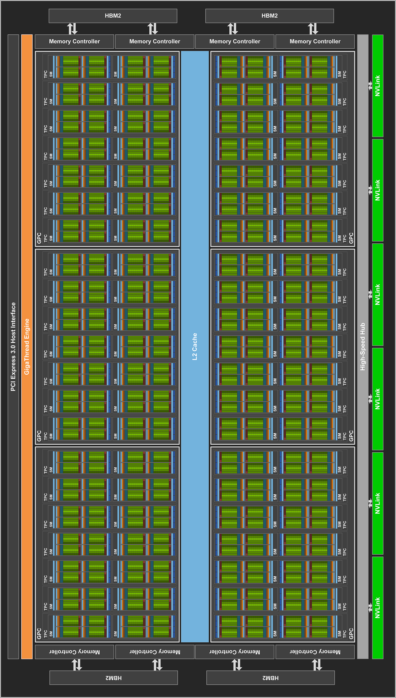
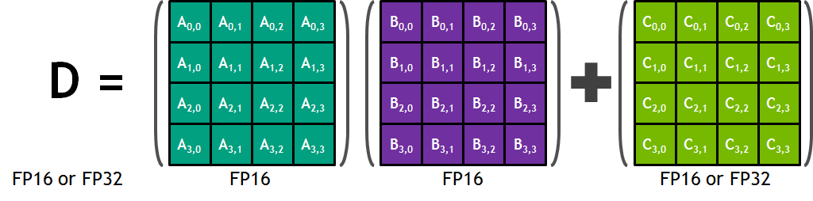
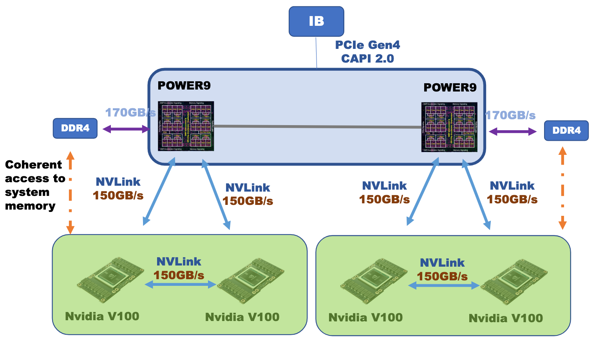

# GPU Example: Tesla V100

It's fine to have a general understanding of what graphics processing units can be used for, and to know conceptually how they work. But at the actual hardware level, what does a particular GPU consist of, if one peeks "under the hood"? Sometimes the best way to learn about a certain type of device is to consider one or two concrete examples. First we'll take detailed look at the Tesla V100, one of the NVIDIA models that has been favored for HPC applications. In a subsequent topic, we do a similar deep dive into the [Quadro RTX 5000](rtx_5000.md), a GPU which is found in TACC's Frontera.

# NVIDIA Tesla V100

NVIDIA Tesla V100, in the SXM2 form factor.

Some scientific applications require 64-bit "double precision" for their floating point calculations. NVIDIA was one of the first GPU manufacturers to recognize this need and meet it in 2007 through its Tesla line of HPC components. Fourteen years later, the Tesla V100 and related Volta devices could be found in 20% of all supercomputers in the [Top500 list](https://top500.org/statistics/details/accelfam/11/).

Among these systems was TACC's Frontera, which initially included a V100-equipped subsytem called "Longhorn" for supporting general-purpose GPU (GPGPU). Prior to its decommissioning in 2022, Longhorn comprised 100+ IBM nodes, each equipped with 4 NVIDIA Tesla V100s.

The Tesla V100 is a good choice for GPGPU because it contains 2560 double precision CUDA cores, all of which can execute a fused multiply-add (FMA) on every cycle. This gives the V100 a peak double precision (FP64) floating-point performance of 7.8 teraflop/s, computed as follows:

$$
2560 \text{FP64 CUDA cores} \times 2 \frac{\text{flop}}{\text{core} \cdot \text{cycle}} \times 1.53 \frac{\text{Gcycle}}{\text{s}} \approx 7.8 \frac{\text{Tflop}}{\text{s}}
$$

The factor of 2 flop/core/cycle comes from the ability of each core to execute FMA instructions. The V100's peak rate for single precision (FP32) floating-point calculations is even higher, as it has twice as many FP32 CUDA cores as FP64. Therefore, its peak FP32 rate it is exactly double the above:

$$
5120 \text{FP32 CUDA cores} \times 2 \frac{\text{flop}}{\text{core} \cdot \text{cycle}} \times 1.53 \frac{\text{Gcycle}}{\text{s}} \approx 15.7 \frac{\text{Tflop}}{\text{s}}
$$

It is interesting to compare the V100's peak FP64 rate to that of an Intel Xeon Platinum 8280 "Cascade Lake" processor on Frontera, assuming it runs at its maximum "Turbo Boost" frequency on all 28 cores, with 2 vector units per core core doing FMAs on every cycle:

$$
56 \text{VPUs} \times 8 \frac{\text{FP64-lanes}}{\text{VPU}} \times 2 \frac{\text{flop}}{\text{lane} \cdot \text{cycle}} \times 2.4 \frac{\text{Gcycle}}{\text{s}} \approx 2.15 \frac{\text{Tflops}}{\text{s}}
$$

Clearly, the Tesla V100 has an advantage for highly parallel, flop-heavy calculations, even in double precision.

The Volta architecture, like all NVIDIA's GPU designs, is built around a scalable array of Streaming Multiprocessors (SMs) that are individually and collectively responsible for executing many threads. Each SM contains an assortment of CUDA cores for handling different types of data, including FP32 and FP64. The CUDA cores within an SM are responsible for processing the threads synchronously by executing arithmetic and other operations on warp-sized groups of the various datatypes.

Given the large number of CUDA cores, it is clear that to utilize the device fully, many thousands of SIMT threads need to be launched by an application. This implies that the application must be amenable to an extreme degree of fine-grained parallelism.

# Volta Block Diagram

The NVIDIA Tesla V100 accelerator is built around the Volta GV100 GPU. This chip is designed to provide significant speedups to deep learning algorithms and frameworks, and to offer superior number-crunching power to HPC systems and applications.

As with NVIDIA's previous Pascal generation, the Volta GV100 GPU consists of many Streaming Multiprocessors (SMs) arranged into a loose hierarchy. The SMs are paired into Texture Processing Clusters (TPCs), which are in turn grouped into GPU Processing Clusters (GPCs). The GV100's overall design is depicted in the figure. In the ideal case, the chip is comprised of 84 Volta SMs, which are partitioned into 6 GPCs.

Volta GV100 block diagram.

The higher-level organization into processing clusters is really only relevant to graphics applications. (But in case you were counting: in the _full_ GV100 GPU shown above, each of the 6 GPCs contains exactly 7 TPCs, for a total of 6 x 7 x 2 = 84 SMs. However, we know that the _actual_ GV100 GPU used in the Tesla V100 has only 80 SMs, implying that a couple of its GPCs must have 6 TPCs.)

The edges of the block diagram show the links to other system components. The longest bar represents the PCIe 3.0 link to the host. The green blocks on the opposite edge are the much faster NVLink 2.0 bridges leading to other NVIDIA devices, as well as to certain POWER9-based hosts, including the IBM AC922 servers in Longhorn (now decommissioned). On the other edges are the eight 512-bit memory controllers (4096 bits total) that connect the entire array of SMs to the device's HBM2 high bandwidth memory. The role of the central L2 cache memory will be described later.

# Inside a Volta SM

We now zoom in on one of the streaming multiprocessors depicted in the diagram on the previous page. Each Volta SM gets its processing power from:

*   Sets of CUDA cores for the following datatypes
    *   64 FP32 CUDA cores
    *   64 INT32 CUDA cores
    *   32 FP64 CUDA cores
*   8 Tensor Cores
*   16 Special Function Units
*   4 Texture units

In general, an SM is subdivided into 4 processing blocks, as shown in the figure. This allows for greater flexibility in scheduling. The CUDA cores can be scheduled so that on every clock cycle, up to 2 warps of FP32 or INT32 can be processed (possibly 1 of each), or just 1 warp of FP64.

NVIDIA Volta Streaming Multiprocessor (SM) block diagram.

Data are supplied to the main part of this hardware through 32 Load/Store units, as shown at the bottom of each processing block.

# Tensor Cores

Matrix multiplications lie at the heart of Convolutional Neural Networks (CNNs). Both training and inferencing require the multiplication of a series of matrices that hold the input data and the optimized weights of the connections between the layers of the neural net. The Tesla V100 is NVIDIA's first product to include _tensor cores_ to perform such matrix multiplications very quickly. Assuming that half-precision (FP16) representations are adequate for the matrices being multiplied, CUDA 9.1 and later use Volta's tensor cores whenever possible to do the convolutions. Given that very large matrices may be involved, tensor cores can greatly improve the training and inference speed of CNNs.

The Tesla V100 has 640 tensor cores in total: there are 8 in each of its 80 SMs, arranged so that one SM's 4 processing blocks hold 2 apiece. A single tensor core can perform 64 half-precision FMA operations per clock cycle, so that the 8 tensor cores in one GV100 SM can perform 512 FMAs (1024 individual floating point operations!) per clock cycle.

The basic role of a tensor core is to perform the following operation on 4x4 matrices:

$$
D = A \times B + C
$$

In this formula, the inputs A and B are FP16 matrices, while the input and accumulation matrices C and D may be FP16 or FP32 matrices (see the figure below).

How an NVIDIA tensor core operates on 4x4 matrices.

NVIDIA has come up with a way to visualize the action of the tensor core in 3D, which is shown in the next figure. However, this illustration isn't easy to understand at a glance. Here is an attempt to describe in words what it aims to illustrate, namely, how the tensor core performs fully parallelized 4x4 matrix operations.

The two matrices to be multiplied, A and B, are depicted outside the central cube (note, matrix A on the left is transposed). The cube itself represents the 64 element-wise products required to generate the full 4x4 product matrix. Imagine all 64 blocks within the cube "lighting up" at once, as pairs of input elements are instantaneously multiplied together along horizontal layers, then instantaneously summed along vertical lines. As a result, a whole product matrix (A times B, transposed) drops down onto the top of the pile, where it is summed with matrix C (transposed), outlined in white. Upon summation it becomes the next output matrix D and is pushed down onto the stack of results. Prior output matrices are shown piling up below the cube, beneath the latest output matrix D (all transposed).

3D illustration of the action of a tensor core.  
Source: NVIDIA's [Volta Architecture Whitepaper](https://images.nvidia.com/content/volta-architecture/pdf/volta-architecture-whitepaper.pdf)

The reality of how the tensor core works is undoubtedly much more complicated than the illustration suggests. Probably it involves a multi-stage FMA pipeline that progresses downward layer by layer. One then envisions successive C matrices dropping in from the top to accumulate the partial sums of the products at each layer.

# V100 Memory & NVLink 2.0

The Tesla V100 features high-bandwidth HBM2 memory, which can be stacked on the same physical package as the GPU, thus permitting more GPUs and memory to be installed in servers. The V100s in TACC Longhorn have eight memory chips per HBM2 stack, and four stacks, yielding 32 GB of GPU memory in each device. This configuration provides 900 GB/sec of peak memory bandwidth across the four stacks.

Data integrity is important in scientific computing, and the CPUs of HPC systems typically have ECC (error correction code) memory as a guard against data corruption. This feature is found in NVIDIA's GPGPU devices as well, and it is a property of both the Tesla V100 and the Quadro RTX 5000.

Most often, data starts out on the host and must be transferred to the memory on the device. Such memory transfers may be initiated explicitly, but it is also possible to do this through Unified Memory, a single memory address space that permits applications to allocate and access a common set of data from code running on either CPUs or GPUs.

Allocating Unified Memory is straightforward: typical calls to `malloc()` or `new` are simply replaced with calls to `cudaMallocManaged()`. The resulting pointer provides access to the data from any processor. CUDA system software works with the hardware to take care of migrating the requested memory pages to the physical memory of the accessing processor, whether it is on the host or the device.

Several streams of memory transfers are typically initiated on the CPU side, so that some GPU kernels can start doing their computations while other kernels wait for data. This is true of explicit transfers as well as those done implicitly through Unified Memory.

## Host-to-Device and Device-to-Device Transfers

The speed at which data can be transferred from the host to the device and back is set by the type of interconnect. In most cases, GPU devices are inserted into expansion slots in their hosts, and the number of PCIe lanes in the slot determines the peak bandwidth. Commonly, the Tesla V100 is connected to the host by 16 lanes (x16) of PCIe3, each capable of 1 GB/s in each direction, providing an overall bidirectional bandwidth of 32 GB/s.

TACC Longhorn, however, was built around IBM POWER9 processors, which at the time were the only CPUs that could communicate directly with GPUs using NVIDIA's NVLink 2.0 technology. NVLink was originally developed to provide dramatic improvements in bandwidth between GPU devices, but in IBM servers it was further used to remove the potential PCIe bottleneck between CPUs and GPUs. The figure below shows the speeds of the bidirectional NVLink 2.0 connections within a Longhorn node.

IBM AC922 with 4 NVIDIA Tesla V100s  
Source: [IBM presentation at GTC 2018](https://on-demand.gputechconf.com/gtc/2018/presentation/s8309-nvidia-v100-performance-characteristics-on-ibm-power-9-system-and-hpc-application-performance.pdf)

If each POWER9 processor had just one V100 attached to it, that single connection could reach the full peak bidirectional bandwidth of 300 GB/s. As it is, the bandwidth to one of the processors is split between two attached GPUs to give 150 GB/s to each, and these GPUs are in turn attached to one another with a 150 GB/s link. The second processor in each node has a similar arrangement with 2 attached GPUs of its own.

The L2 cache plays a key role in moving data from the host to the device's global memory, as well as from global memory to the SMs and CUDA cores. The full memory hierarchy and the properties of the various caches within it were [detailed in the GPU Memory topic](gpu_memory.md).

In conclusion, the high flop rate of a GPU is only meaningful if the data rate from and to the host can keep up. NVLink 2.0 and HBM2 may therefore be crucial in allowing data-heavy applications to use the full speed of the V100. In any case, it is a viable option for applications that need FP64 precision.